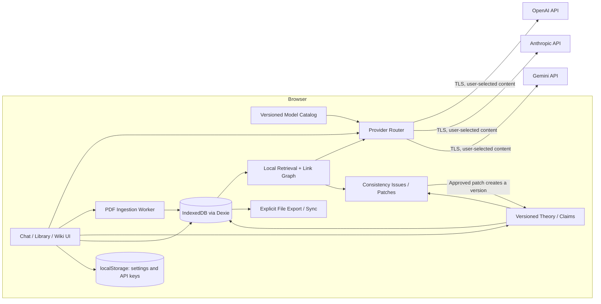

# Qaxiom 구현 계획서

> 2026-10-04 AI 분석 필터 탭(`[검토 필요]`, `[처리 완료]`) 클릭 시 해당 단락/지적 사항만 모아서 표시하도록 뷰 개편: `[검토 필요]` 또는 `[처리 완료]` 탭 선택 시, 지적 사항이 없는 무관한 문서 단락을 숨기고 선택한 필터 상태의 지적 사항을 갖고 있는 본문 단락들만 핀포인트로 모아서 보여주도록 `snapshot.blocks.filter(...)` 조건부 렌더링을 적용했다. 검증: oxlint, 단위 테스트 44개 파일 309개 통과(2개 skipped), production build 성공. 실제 API·원격 CI·배포·commit/push는 수행하지 않았고 OCR은 비목표다.

> 2026-10-04 AI 분석 결과 상태 필터 탭(`[검토 필요]`, `[처리 완료]`) 작동 버그 수정 및 안내 배너 보완: `pendingFindings.length === 0`일 때 전체 지적 목록(`findings`)으로 잘못 롤백되던 `displayedFindings` 조건문 logic 오류를 정정하여, `[검토 필요 (0)]` 클릭 시 0건이 바르게 필터링되도록 수정하고 `🎉 검토가 필요한 미해결 지적 사항이 없습니다. (모든 의견 처리 완료)` 스마트 안내 바를 추가했다. 검증: oxlint, 단위 테스트 44개 파일 309개 통과(2개 skipped), production build 성공. 실제 API·원격 CI·배포·commit/push는 수행하지 않았고 OCR은 비목표다.

> 2026-10-04 AI 분석 지적 카드 기각/적용 처리 시 선택 버튼 은닉 및 상태 배지·되돌리기 UI 적용: 지적 항목에 대해 `[기각]` 또는 `[적용]` / `[확인 완료]` 클릭 시, 선택 버튼들(`[확인 완료]`, `[기각]`, `[나중에]`)을 숨기고 `🚫 기각 처리된 지적 사항입니다.` 또는 `✓ 적용/확인 완료 처리되었습니다.` 전용 상태 배지 및 1-클릭 `[↺ 다시 검토]` 버튼으로 전환되도록 개선했다. `[검토 필요]` 탭에서는 처리 완료 시 해당 지적 카드가 실시간으로 제외된다. 검증: oxlint, 단위 테스트 44개 파일 309개 통과(2개 skipped), production build 성공. 실제 API·원격 CI·배포·commit/push는 수행하지 않았고 OCR은 비목표다.

> 2026-10-04 AI 분석 결과 뷰 모드 토글 제거 및 '전체 문맥 보기' 단일 모드 표준화: 상단 헤더의 `[Diff 모아보기]` / `[전체 문맥 보기]` 모드 전환 토글 버튼을 제거하고, 전체 본문 문맥 안에서 원문 단락과 AI 검토 의견(`==>`), 원문 인용, 수정안 diff, 1-클릭 적용/확인완료/기각/나중에 결정 조치를 바로 확인할 수 있는 전체 문맥 뷰로 통합했다. 검증: oxlint, 단위 테스트 44개 파일 309개 통과(2개 skipped), production build 성공. 실제 API·원격 CI·배포·commit/push는 수행하지 않았고 OCR은 비목표다.

> 2026-10-04 사용자 표기 명칭 개편 ('연구 문서' / '연구문서' -> '연구 노트' / '연구노트'): UI, 툴팁, 사이드바, 헤더, 설정 모달, 삭제 대화상자, 빈 화면, AI 검토 프롬프트, 에러 메시지의 모든 "연구 문서" / "연구문서" 표기를 "연구 노트" / "연구노트"로 전환했다. 내부 변수/데이터 스키마(`TheoryDocument`)는 호환성을 보존한다. 검증: oxlint, 단위 테스트 44개 파일 309개 통과(2개 skipped), production build 성공. 실제 API·원격 CI·배포·commit/push는 수행하지 않았고 OCR은 비목표다.

> 2026-10-04 AI 분석 삭제 UI 개선, 조건 전용 지적 [✓ 확인 완료] 버튼, 처리 완료 배너 및 미리보기 탭 AI 지적 연동:
> 1. **인라인 삭제 확인 UI**: 브라우저 팝업 깜빡임 및 포커스 이탈을 방지하는 **`[삭제할까요? 확인 | 취소]`** 인라인 토글 버튼을 적용했다.
> 2. **텍스트 교체안 없는 지적 `[✓ 확인 완료]` 버튼**: `replacement`가 `null`인 조건 지적의 경우 `[기각]` 대신 `[✓ 확인 완료]`로 1-클릭 검토 완료 상태를 처리할 수 있게 보완했다.
> 3. **모두 처리 완료 축하 배너 및 상태 필터 탭**: 모든 의견 처리 시 완료 배너를 띄우며 `[전체] | [검토 필요] | [처리 완료]` 탭으로 상태별 조회가 가능하다.
> 4. **마크다운 미리보기(`미리보기`) 탭 AI 지적 연동 칩**: `미리보기` 탭 진입 시 상단에 AI 지적 칩 바를 노출하여 클릭 한 번으로 `분석` 탭의 해당 지적 카드로 부드럽게 스크롤 이동한다.
> 검증: oxlint(0 warnings/0 errors)·단위 테스트 45개 파일 309개 통과(2개 skipped)·production build 성공 및 단위 테스트 검증 완료. 실제 API·원격 CI·배포·commit/push는 수행하지 않았고 OCR은 비목표다.

> 2026-10-04 AI 문서 정합성 분석 결과 헤더 [삭제] 버튼 추가:
> 1. **분석 결과 [삭제] 버튼 추가**: 분석 결과 화면(`DocumentAnalysisView`) 상단 우측 액션 그룹(`Diff 모아보기`, `전체 문맥 보기`, `다시 분석`) 바로 오른쪽에 `[🗑️ 삭제]` 버튼을 배치했다.
> 2. **IndexedDB(Dexie) 영구 삭제 연동**: `deleteAnalysisRun` 함수로 Dexie `analysis_runs` 테이블에서 해당 ID를 삭제하고, 히스토리 배열을 갱신하여 남아있는 이전/다음 회차 분석 결과로 시점을 자동 전환한다.
> 검증: oxlint(0 warnings/0 errors)·단위 테스트 45개 파일 309개 통과(2개 skipped)·production build 성공 및 단위 테스트 통과. 실제 API·원격 CI·배포·commit/push는 수행하지 않았고 OCR은 비목표다.

> 2026-10-04 AI 문서 정합성 분석 페이지 'Diff 모아보기 피드(Diff-Centric View)' 및 이전 분석 기록 관리 개편:
> 1. **Diff 중심 모아보기 피드(Diff-Centric View)**: AI 문서 정합성 분석 결과 화면(`DocumentAnalysisView`)에 진입 시, 수많은 단락 스크롤 없이 AI가 지적한 문제점과 교체안만 즉시 확인할 수 있도록 `viewMode === 'diff'` 피드를 기본 뷰로 적용했다. 각 지적마다 `- 원문`과 `+ AI 수정안`을 side-by-side로 시각화하고 인용과 확인할 조건을 명확히 제시한다.
> 2. **1-클릭 Diff 변경 적용 및 블록 ID 매핑 완벽 보존**: 블록 ID 매핑 및 교체 메커니즘을 100% 보존하여, 피드 카드의 `[✓ 편집 내용에 적용]` 버튼 클릭 시 마크다운 본문에 즉시 안전하게 반영된다. `[기각]`과 `[나중에]` 결정 버튼으로 검토 상태를 직관적으로 제어할 수 있다.
> 3. **Diff 모아보기 ↔ 전체 문맥 보기 상단 토글**: 상단 헤더에 `[🔄 Diff 모아보기 (N)]`과 `[📄 전체 문맥 보기]` 모드 전환 토글을 두어 사용자가 필요할 때 언제든 전체 문서 흐름 안에서 지적 위치를 볼 수 있도록 지원한다.
> 4. **이전 분석 기록 온디맨드 노출 UX**: 문서 작성/마크다운 미리보기 단계에서는 에디터 영역을 방해하지 않고, AI 분석 설정 모달(`activeModal === 'analysis'`) 하단의 `[이전 분석 결과 보기 (N건)]` 버튼이나 분석 페이지 상단의 회차 선택 드롭다운을 통해서만 이전 분석 기록을 열람할 수 있도록 정리했다.
> 검증: oxlint(0 warnings/0 errors)·단위 테스트 45개 파일 308개 통과(2개 skipped)·production build 성공 및 신규 단위 테스트 `DocumentAnalysisView.test.tsx` 3건 검증 완료. 실제 LLM API·원격 CI·배포·commit/push는 수행하지 않았고 OCR은 비목표다.

> 2026-10-04 AI 문서 정합성 분석 모달 및 토큰 제한·섹션 분할 분석(Chunking) 구현: `AI 분석` 버튼 클릭 시 모달을 띄워 분석 모델, 검토 포커스 프리셋, 추가 지시사항을 설정하고 전송 전 토큰 용량을 검토한다. `AVAILABLE_MODELS`에 모델별 Context Window 한도(GPT-6 128K~200K, Claude 5 200K, Gemini 1M~2M)를 적용하고, `estimateTokenCount` 실시간 추정 로직과 `formatTokenLimit`으로 본문·연구기준·지시사항 토큰 수치 및 85% 안전 입력 한도 점유율(%)을 시각화했다. 용량 초과 시 실행 버튼을 차단하고 1M/2M Gemini 모델로의 1-Click 추천 전환과 함께, 블록 ID 매핑·1-클릭 Diff 변경·인라인 주석 100% 보존 `[🧩 섹션별 분할 분석 (Chunking Mode) 사용]` 옵션을 추가하여 대용량 문서도 안전하게 쪼개어 순차 분석할 수 있도록 보완했다.

> 2026-10-04 현재 AI 분석 흐름: 상단 아이콘 클릭 한 번으로 미저장 내용을 브라우저 DB의 새 문서 버전으로 자동 저장한 뒤, 그 버전의 연구문서 전체 Markdown·ResearchContract·블록 위치를 선택 모델에 전송한다. 앱 자체 40 KB 분할/부분 범위 선택/전송 미리보기/기존 피어 리뷰 회차는 현재 AI 분석 진입점에서 사용하지 않는다. 새 `analysis_runs`(Dexie v25, 백업 형식 v24)에 모델·버전/hash·정확한 원문 인용·검토 범위·한계·의견 상태를 별도로 보존한다. 결과는 중앙 `분석` 탭에서 원문 바로 아래 `==>` 주석으로 읽고, 수정안은 변경 구간 diff를 확인한 뒤 편집 내용에만 반영한다. 적용 후 사용자가 저장해야 새 버전이 되며 원문 변경 시 이전 수정안 적용을 거부한다. 외부 자료는 자동 첨부하지 않고 OCR은 비목표다. 제공사별 100만 토큰 지원 여부·실제 장문 수용/비용/검토 품질은 런타임에서 보증하지 않으며 제공사 거부는 실패로 표시한다. 기존 검토 데이터와 코드는 과거 기록/백업 호환성을 위해 보존하되 아래 옛 모달 설명은 현재 UI가 아니다. 다음 작업은 모델별 정확한 토큰 사전 계산, 오래된 검토 E2E 재정리, 실제 제공사 응답 품질 평가다.

> 2026-10-04 AI 검토 요청 제한 변경: 내부 AI 내용·논리 검토와 선택 외부 원문 대조의 앱 자체 UTF-8 40 KB 거부를 제거했다. 새 기본 분석은 저장 연구문서 전체와 ResearchContract를 한 요청으로 준비하며, 전송 전 모델·연속된 원문·요청 크기·누락 범위를 보여 준다. 새 분할 계획 UI는 제거하고 부분 재검토만 선택 설정으로 남겼다. 기존 다구간 검토 계획/결과는 백업 호환성과 이력 추적을 위해 보존한다. 제공사별 실제 토큰 한도·비용·장문 응답 품질은 검증하지 않았고, 제공사 거부·시간 초과는 명시적 실패로 기록한다. 아래 40 KB 분할 설명은 당시 구현 이력이며 현재 AI 검토 동작이 아니다. 다음 과제는 실제 모델별 장문 수용·비용·검토 품질 평가다.

> 2026-10-04 AI 분석 미리보기 가독성 수정: 모달 안의 그리드 최소 너비를 0으로 제한하고 긴 문서·기술 텍스트의 줄바꿈을 명시했다. 문서 원문 줄바꿈은 보존하되 모달의 가로 넘침을 막고 본문에는 읽기 쉬운 글꼴·행간을 적용했다. 전송 내용과 검사 범위 계약은 변경하지 않았다. 다음 과제는 실제 장문·수식 문서의 시각적 품질 평가다.

> 2026-10-04 AI 분석 화면 재구성: 가운데 창 상단의 분석 버튼은 아이콘 전용이며 hover/focus에 `AI 분석`을 표시한다. 모달은 현재 문서·모델 → 전송 내용 확인 → 명시적 실행 → 최신순 결과 흐름으로 정리했다. 문단 범위·요청 한도, 회차 관리, 로컬 구조 확인, 외부 문헌 대조는 독립적인 접힌 선택 영역이다. 결과의 원시 ID/JSON 노출은 없앴지만 보고서와 저장 기록은 유지한다. 다음 검증 과제는 실제 제공사 응답의 품질과 복잡한 문서·모바일 화면의 사용성 확인이다.

> 2026-10-04 추가 정리: 레퍼런스 검색의 정본 선택 전 프로젝트 자료 범위 선택도 제거했다. 자료는 명시적으로 선택하고, 저장된 연구노트를 기준으로 질문하면 해당 문서의 기존 제한 정책은 계속 적용된다. 과거 `project_only` 기록은 복원 호환성을 위해 유지한다.

> **현재 UI·UX:** 로컬 폴더 선택 → 3단 워크스페이스(좌측 문서 목록, 중앙 연구노트 에디터, 우측 AI 대화)를 사용한다. 문서 상단바에는 AI 분석·저장만 남겼고 버전 비교는 버전 표시, 연구 기준은 편집 도구줄에서 연다. 문서 삭제는 왼쪽 목록의 개별 확인창에서 실행한다. `프로젝트 자료·문서 관리`와 내부 프로젝트 이름·문서 소속 변경, 프로젝트 허용 자료 편집, 외부 주장 추출 요청·채택·연결 UI/새 기록 생성 기능은 제거했다. 로컬 폴더 이름·핸들은 별도이며, 기존 문서·과거 정책·주장/연결 기록은 백업 및 무결성 검증용으로 보존한다. 기존 제한 정책은 읽기 전용으로 계속 적용되므로 이를 가진 작업공간의 자료 범위 변경은 현재 UI에서 할 수 없다. 선택 폴더의 `.md` 정본 저장·내용 재열기·프로젝트별 데이터 분리는 아직 구현되지 않았고 문서·대화는 브라우저 DB에 저장된다. 아래 오래된 Phase 설명은 구현 이력이며 현재 노출 기능을 뜻하지 않는다.

> 문서 버전: v3.56.0  
> 검토 기준일: 2026-10-04  
> 제품 형태: Qaxiom이 운영하는 애플리케이션 백엔드가 없는 BYOK 연구 워크스테이션  
> 현재 단계: 문서 버전·연구 기준·AI 검토·선택 원문 대조와 명시적 전송 승인, 로컬 RAG/임베딩 및 백업 기반을 유지한다. 내부 프로젝트 편집·허용 자료 정책 생성/변경·외부 주장 채택/교차 프로젝트 연결은 2026-10-04 제품 범위에서 제거했다. 기존 정책·주장/연결의 저장 형식과 검증은 유지한다. 실제 문헌 품질, 모델별 예산, 폴더 정본 저장과 완성도 평가는 남아 있다.

이론 문서, RAG, Wiki, 정합성 검사의 기술 계약은 [RAG_DESIGN_PLAN.md](./RAG_DESIGN_PLAN.md)에 남기고, 사용자가 보는 작업 흐름과 다음 구현 순서는 [UI_UX_REDESIGN_PLAN.md](./UI_UX_REDESIGN_PLAN.md)를 따른다. 아래 Phase 2–4는 기존 R1–R6 구현 기록과 남은 기술 과제를 요약한다. GitHub Actions와 배포는 보류한다.

새 연구노트 화면은 `제목·본문 작성 → 문서 저장 → AI 분석 범위 확인`의 단일 경로로 정리했다. 저장 후 상단바에는 AI 분석·저장만 둔다. 버전 표시는 비교 진입점, 연구 기준은 편집 도구줄에 두고, 현재 문서 삭제는 좌측 목록에서만 실행한다. 내부 프로젝트/자료 정책/외부 주장 연결 관리는 더 이상 열리지 않는다. 현재 저장 버튼은 브라우저 DB에만 기록하며 폴더 `.md` 정본 쓰기와 프로젝트별 분리는 다음 저장 계약 작업이다.

문서 저장 성공 알림은 4초 뒤 자동으로 사라진다. 저장 실패 알림은 이 자동 해제 대상이 아니며, 저장된 버전과 이전 버전 보존 동작은 그대로다.

가운데 연구문서 상단바의 `닫기` 버튼은 제거했다. 문서를 빈 화면으로 닫는 버튼 대신 왼쪽 목록에서 문서를 선택한다. Escape로 문서를 닫는 기존 동작과 저장하지 않은 변경의 확인은 유지한다. 단, 왼쪽 목록에서 다른 문서를 선택하거나 새 문서를 만드는 경로에는 아직 미저장 변경 확인이 없으므로 후속 보호가 필요하다.

가운데 문서의 미리보기는 KaTeX를 유지하되 본문을 최대 860px 읽기 폭으로 정렬하고 제목 계층·문단 간격·블록 수식 크기와 여백을 정돈했다. 편집 화면과 오른쪽 대화창에는 적용하지 않는다. 긴 수식은 미리보기 안에서 가로 스크롤하며, LaTeX 명령 지원 범위는 기존 KaTeX 계약 그대로다.

가운데 미리보기에서만 `KaTeX`(기본)와 `MathJax`(SVG)를 전환해 비교할 수 있다. MathJax는 선택 시에만 로컬 번들을 지연 로드하며 CDN/API로 문서를 보내지 않는다. MathJax 추가 청크는 약 1.79 MB(압축 614 KB)라 첫 선택 시 로딩이 있을 수 있다. 오른쪽 대화창은 KaTeX를 유지한다. 렌더러별 모양·성능의 실제 연구노트 비교는 다음 사용성 평가 항목이며 정본 Markdown은 바뀌지 않는다.

로컬 시연은 저장소 루트의 `./run.sh`로 시작한다. Node.js/npm이 필요하며 의존성이 없을 때만 `npm ci`를 실행한 뒤 Vite를 `127.0.0.1`에 띄운다. 이 스크립트는 API 키를 읽거나 배포하지 않는다. 모바일 반응형 추가 개발은 사용자 지시로 보류한다.

서비스 전체 완성 감사는 [SERVICE_COMPLETION_AUDIT.md](./SERVICE_COMPLETION_AUDIT.md)에 유지한다. 커밋·푸시·배포·OCR을 제외하되 남은 제품 범위를 로컬 기준선만으로 축소하지 않는다.

## 제품 흐름 재설계 결정 (2026-10-03)

기존 계획은 근거·승인·검토 예산의 무결성을 먼저 구현했지만, 사용자에게 그 내부 절차를 선행 입력으로 요구했다. Qaxiom의 기본 경험은 **문서 넣기 → AI 분석 범위 확인 → AI가 주장·가정·문제·수정 후보를 제시 → 사용자가 수정/채택 → 새 버전 재분석**이다. ResearchContract 여섯 칸, 문단 선택, 예산, 그래프 승인, Wiki 탐색은 첫 분석의 필수 절차가 아니다.

| 단계 | 기본 화면 | 내부에서 구분해 보존할 것 |
| --- | --- | --- |
| 문서 입력·저장 | 제목·본문과 저장 버튼 | 정본 버전·원문 블록/hash; 저장만으로 AI 호출하지 않음 |
| AI 분석 | 단일 `AI로 문서 분석` 진입, 모델·실제 전송 문단·누락 범위 승인 | 검토 실행/예산, AI가 제안한 주장·Issue와 원문 인용 |
| 수정 반복 | 문제 설명·원문·수정 diff를 읽고 승인/수동 편집, 재분석 | 과거 버전/검토와 사용자의 채택·기각 |
| 탐색·확장 | 필요할 때만 연구 기준·외부 대조·그래프/Wiki·상세 예산 열기 | AI 추출 후보와 사용자 승인 관계, 정본과 외부 근거의 독립성 |

이번 UI 전환은 저장을 제목·본문 바로 아래로 옮기고, 저장된 문서의 전체 문단 AI 분석 미리보기 버튼을 앞세우며, 수동 범위/예산과 외부 대조를 접는 첫 단계다. 저장 시 버전형 블록화는 유지하지만 AI 주장 추출, 자동 그래프 구축, Wiki 반영, 벡터 색인, 장문 분석의 자동 배치, 검토 결과의 쉬운 요약·문서 전체 재검사 안내는 아직 기본 흐름으로 완성되지 않았다. 이 기능들을 구현·검증하기 전에는 “문서만 넣으면 알아서 RAG/그래프/Wiki가 완성된다”고 표시하지 않는다. 다음 우선순위는 장문 전 범위 분석 계획/전송 승인, 근거 달린 AI 후보를 별도 상태로 저장·표시, 결과에서 바로 수정·재검사로 이어지는 화면이다. 저장된 초안과 자체 파생 Wiki는 독립 외부 증거가 아니다.

## 1. 이번 검토에서 내린 결정

1. **"Zero-Backend"의 의미를 좁힌다.** Qaxiom이 별도 서버나 DB를 운영하지 않는다는 뜻이며, 질문과 문서는 선택한 LLM 제공사로 전송된다. 따라서 "제3자에게 절대 전송되지 않는다"거나 "완전한 보안"이라고 표현하지 않는다.
2. **로컬 검증 기준을 유지한다.** lint·단위 테스트·브라우저 검증을 유지하며 문서 연구 루프를 구현한다. 원격 CI·배포 검증은 사용자 결정에 따라 보류하며 출시 완료 조건으로 남긴다.
3. **로컬 저장소를 역할별로 분리한다.** API 키와 가벼운 환경설정만 `localStorage`, 대화·문서·위키는 IndexedDB(Dexie), 사용자가 명시적으로 선택한 내보내기/동기화만 파일 시스템을 사용한다.
4. **Wiki보다 근거 추적을 먼저 만든다.** PDF의 페이지/문단 위치를 보존하지 않은 자동 요약 위키는 연구 도구로서 신뢰하기 어렵다. 모든 합성 결과가 원문 위치로 돌아갈 수 있게 `SourceSpan`을 먼저 설계한다.
5. **모델 목록은 코드에 고정된 마케팅 카탈로그가 아니라 검증 가능한 설정으로 관리한다.** 모델 수명주기와 API 규격은 자주 바뀌므로 공급자별 기능 플래그, 검증일, 활성 상태를 함께 관리한다.
6. **폴더 동기화와 Arena는 핵심 데이터 계층 이후로 미룬다.** 브라우저 호환성, 충돌 처리, 중복 비용과 취소 동작을 먼저 정의해야 한다.
7. **정본 문서의 반복 발전을 제품 중심에 둔다.** 아이디어 → 문서 버전 → 정합성 Issue → 수정 diff → 재검사를 구현한다. Wiki는 Claim과 근거를 탐색하는 뷰로 둔다.
8. **레퍼런스 검색과 이론 검증을 연결한다.** BM25·벡터·그래프를 결합하고 원문을 회수한다. 자체 문서를 재첨부하면 계보를 유지하며 독립된 외부 근거로 취급하지 않는다.
9. **OCR은 제품 비목표로 확정한다.** 텍스트 계층이 없는 PDF는 검색 불가 범위를 표시하고 사용자가 검색 가능한 텍스트나 PDF를 준비하게 한다. OCR 구현·외부 OCR 전송·자동 fallback은 만들지 않는다.

## 2. 제품 목표와 비목표

### 목표

- 연구자가 본인 API 키로 여러 LLM을 한 인터페이스에서 사용할 수 있다.
- 연구 아이디어를 버전형 이론 문서로 발전시키고 검토 Issue와 Patch를 통해 반복 수정한다.
- 내부 정합성, 외부 레퍼런스 호환성, 수치·심볼릭·형식 검증 결과를 구분한다.
- 대화, 논문, 위키가 기본적으로 현재 브라우저 프로필 안에 저장된다.
- 수식, 표, 코드, BibTeX를 안정적으로 읽고 복사하거나 Markdown으로 내보낼 수 있다.
- 문서 기반 답변은 페이지/구간 단위 근거를 보여 주며 원문으로 돌아갈 수 있다.
- 제공사 전송 전 대상 모델, 예상 범위와 민감 데이터 주의사항을 사용자가 알 수 있다.

### 비목표

- LLM 제공사까지 포함한 오프라인 또는 무전송 시스템
- 브라우저 저장소만으로 보장하는 엔터프라이즈급 비밀 관리
- 모델이 생성한 인용·증명·연구 결론의 자동 진실 보장
- 첫 출시에서의 실시간 다중 기기 동기화 또는 협업 편집
- 모든 브라우저에서 동일한 로컬 폴더 쓰기 기능
- 스캔 PDF와 이미지에서 문자를 인식하는 OCR

## 3. 현재 구현 기준선

| 영역 | 상태 | 확인된 내용 | 남은 핵심 작업 |
| --- | --- | --- | --- |
| React/Vite 앱 | 구현됨 | React 19, TypeScript, Vite 및 지연 로드 | 문서·검토 UI, 보류된 CI 원격 적용 |
| 대화 UI | 구현됨 | 세션 관리, 스트리밍, 중단·오류 상태와 명시적 재시도 | 문서 버전 연결, 접근성 검증 |
| 연구 모드 | 구현됨 | 일반/피어리뷰/교정/수학/문헌 종합 5종 | 프롬프트 회귀 평가 |
| 학술 렌더링 | 구현됨 | Markdown, KaTeX, 표, 코드/BibTeX 복사, Markdown 내보내기 | 악성 Markdown 정책과 렌더링 테스트 |
| 공급자 어댑터 | 부분 구현 | Gemini/OpenAI/Anthropic 요청과 mock 회귀; OpenAI Responses/임베딩은 합성 입력의 Node 직접 호출 스모크 통과 | Gemini/Anthropic 실제 호출, 브라우저 CORS·전체 UI 전송, ContextBundle 계약 |
| 설정/온보딩 | 부분 구현 | API 키 입력, 키 부재 안내, 공급자 fallback | 키 검증은 실제로 없으며 저장 위험 고지 필요 |
| 로컬 영속성 | 부분 구현 | 설정은 `localStorage`, 세션·메시지는 Dexie에 분리 저장, legacy 마이그레이션과 버전형 작업공간 백업·복원 | 대용량 성능 검증, 문서 파생 데이터 삭제 정책 |
| 파일 시스템 동기화 | 미구현 | 계획만 존재 | 호환성 fallback, 권한·충돌·원자적 쓰기 |
| 문서/RAG/정합성 | R1 기반·R2–R5 부분 구현 | 정본/원문·연구 기준의 명시적 블록 연결·BM25+임베딩/RRF, 반복 제어·완성 세대 전환, 승인 관계/Wiki·검토/답변 전제·그래프 분할·Patch 영향·승인형 외부 원문 대조·외부 Claim 추출 후보/명시적 채택·철회 원장/프로젝트 범위 탐색·교차 프로젝트 어휘 후보/명시적 연결·별도 관계 승인 계보·프로젝트 조직/외부 대조/정본 및 프로젝트 단독 RAG·임베딩 자료 정책과 백업 v22 | 실제 품질·의미적 반복·토큰 예산·재정렬·의미 후보/통합 검색·미선언 의미 의존성·외부 Claim 의미 기반 개념 통합·수학 |
| 자동 배포 | 미구현 | 기존 정적 `site/` 배포 파일은 현재 작업 트리에서 제거된 상태 | Vite `dist/` 기준 워크플로 복구 |
| 자동 테스트 | 구현됨 | Vitest·컴포넌트·Playwright 테스트와 별도 1만/5만 구간 BM25·IndexedDB 자료 선택+Worker 성능 측정, 실문헌 라벨/범위/hash 입력 검증 도구 존재 | 실제 문헌 라벨 확보·평가 실행 및 Issue 평가, hash 검증·벡터/UI/메모리·1만 메시지 측정 |

상세한 완료 내역과 검증 결과는 [`completed.md`](./completed.md)를 기준으로 한다.

연구노트 검토 화면은 저장 후 `AI로 문서 분석`을 앞세우고 전송 승인 전에는 분석이 시작되지 않았음을 분명히 한다. 인터넷 전송 없는 기본 구조 확인은 선택적 상세 검토에 둔다. 빈 선택 기준은 하나의 안내로 묶는다. 상태·문단·주장·Issue는 한국어 이름으로 표시하며 ID/hash/원시 요청은 접힌 기술 정보에 둔다. AI 전송 미리보기는 선택 모델·연구 기준·원문 문단을 사람이 읽을 수 있는 형태로 보여 준다.

연구노트 모달은 문서 목록·제목·본문·저장과 검토를 주 흐름으로 둔다. 프로젝트 이름/이동·자료 허용 정책·외부 주장 원장은 접힌 `프로젝트 관리 · 자료 설정`에, 기호·의존성 선언·관계/Wiki·버전 비교는 접힌 `고급 문서 도구`에 둔다. 기존 기능과 데이터는 유지하며 사용자가 펼쳤을 때만 관리 설명을 보여 준다. 초기 화면의 복잡도를 줄이는 표시 변경이고 RAG 자료 범위나 검토 판정 규칙은 변경하지 않는다.

제목과 본문을 입력하면 `AI로 연구 기준 찾기`에서 현재 모델과 전송할 제목·본문을 먼저 확인한다. 본문이 40 KB를 넘으면 원문을 빠짐없이 40 KB 이하 요청 구간으로 나눠 구간 수·각 구간 원문·요청 횟수를 미리 보여 준다. 명시적 실행 후 구간별로 순서대로 요청하고, 목적·가정·정의·기호·범위·미해결 문제별 첫 유효 후보 중 원문에 정확히 존재하는 인용을 동반한 것만 표시한다. 사용자가 항목별로 체크하고 반영한 뒤 저장해야 정본 버전에 들어간다. 문서가 바뀌면 이전 미리보기·후보를 사용할 수 없다. 구간별 첫 후보 통합은 문서 전체의 의미적 종합이 아니며, 정확한 인용 일치도 타당성이나 정합성을 보증하지 않는다. 긴 문서일수록 제공사 요청·비용이 늘고, 중단/오류 시 미완료 후보를 자동 적용하지 않는다.

연구 기준 찾기 버튼은 접힌 `연구 기준` 제목의 오른쪽에 항상 표시하고, 제목·본문 중 하나라도 비어 있으면 비활성화 이유를 함께 보여 준다. 버튼을 누르면 기준 입력란이 펼쳐지고 전송 확인이 나타난다. AI 후보 중 사용자가 체크해 반영한 값은 펼쳐진 입력란에서 확인·수정한 뒤 저장한다. 버튼 클릭만으로 AI 전송이나 기준 자동 저장을 하지 않는다. 본문 편집보다 앞에 별도 제안 카드가 나타나지 않는다.

선택한 연구노트는 삭제 전 문서명과 버전·문단·검토·관계 건수, 프로젝트 대표 변경 여부를 확인한다. 삭제는 한 로컬 트랜잭션에서 해당 문서의 버전·문단·검토 실행/회차·승인 관계를 정리하고, 빈 프로젝트는 제거하거나 남은 문서에 대표를 넘긴다. 과거 답변·파생 레퍼런스·외부 주장·다른 기록이 문서나 버전을 참조하거나 검토 요청이 진행 중이면 삭제를 거부한다. 이전 JSON 백업은 바꾸지 않는다. 이는 휴지통이 없는 현재 작업공간의 물리 삭제이며 백업이 없으면 복구할 수 없다.

## 4. 목표 아키텍처



### 데이터 소유권 규칙

- Qaxiom 운영 서버에는 API 키, 대화, 원문을 저장하지 않는다.
- API 키는 현재 브라우저 프로필의 `localStorage`에 평문으로 저장되므로 XSS, 악성 확장 프로그램, 공유 프로필에 대한 보호 수단이 아니다.
- 대화와 문서는 IndexedDB에 저장하고 스키마 버전과 마이그레이션을 명시한다.
- LLM 요청에 포함된 내용은 해당 제공사의 처리·보존 정책을 적용받는다.
- 브라우저 데이터 삭제 전에 내보내기 경고와 백업 경로를 제공한다.

## 5. 모델 및 공급자 전략

모델 카탈로그는 2026-10-03 공식 문서를 기준으로 1차 정비했다.

- OpenAI: `gpt-6-astra`, `gpt-6.1-sol`, `gpt-6-luna`. Responses API와 typed SSE를 사용하고 `store: false`를 명시한다.
- Anthropic: `claude-opus-5`, `claude-sonnet-5`. 최신 모델에서 deprecated된 임의 `temperature`를 보내지 않는다.
- Google: `gemini-3.1-pro-preview`, `gemini-3.8-flash`. preview 상태를 UI에 표시한다.
- 과거 `claude-*-5-5`, `gemini-3.1-pro`, `gemini-2.5-flash` 설정은 로드 시 현재 ID로 변환한다.
- 각 모델은 API 종류, 활성/preview 상태, temperature 지원, reasoning effort와 검증일을 명시한다.

2026-10-03에 제공된 `.env.local` 키로 고정된 합성 입력만 사용해 Node에서 `gpt-6-astra` Responses 스트리밍과 `text-embedding-3-small` 512차원 임베딩을 각 1회 호출해 통과했다. 키·응답 내용은 출력하지 않았다. 다른 모델/공급자, 브라우저 직접 호출(CORS), 실제 연구 자료 전송과 장시간 안정성은 미검증이므로 출시 검증은 미완료다. OpenAI 오류 본문은 입력이나 비밀을 되돌릴 수 있어 UI 오류에 노출하지 않고 HTTP 상태/일반 오류만 표시한다.

### 모델 카탈로그 최소 필드

```ts
type ModelCapability = {
  id: string;
  provider: 'openai' | 'anthropic' | 'gemini';
  status: 'active' | 'preview' | 'deprecated' | 'disabled';
  api: 'responses' | 'messages' | 'generate-content';
  supportsTemperature: boolean;
  contextWindow?: number;
  verifiedAt: string;
};
```

앱 시작 시 임의의 외부 요청으로 키를 검증하지 않는다. 사용자가 저장 후 "연결 테스트"를 명시적으로 눌렀을 때 최소 요청을 보내고, 공급자별 성공·인증 실패·모델 접근 불가를 구분한다.

## 6. 단계별 로드맵

### Phase 0 — 출시 기준선 복구 (P0, 원격 검증 보류)

목표: 현재 프로토타입이 실제 지원 모델과 배포 환경에서 반복 가능하게 동작하도록 만든다.

- [x] 공식 모델 ID로 카탈로그를 교체하고 공급자별 파라미터/엔드포인트 기능 플래그를 적용한다.
- [x] 설정 화면의 과거 모델명과 "무료", "완전한 보안" 같은 보장성 문구를 교정한다.
- [x] 각 공급자의 SSE 파서를 이벤트 경계, 멀티라인 데이터, 오류 이벤트, 마지막 잔여 버퍼까지 처리하도록 공통화한다.
- [x] 중단을 오류와 구분하고, 빈 답변·부분 답변·재시도 정책을 정의한다.
- [x] Vitest를 도입하고 SSE 파서와 세 공급자 스트리밍 어댑터의 회귀 테스트를 추가한다.
- [x] React Testing Library로 저장소, 라우터와 주요 UI 흐름을 테스트한다.
- [x] Playwright로 키 없이 시작, 설정 저장, 세션 전환, 내보내기 흐름을 테스트한다. 실제 API 테스트는 별도 수동/보호된 스모크 작업으로 둔다.
- [x] 린트 경고를 0개로 만든다.
- [부분] 앱 JavaScript 청크는 500 kB 아래로 분할했다. PDF.js 지연 Worker 자산은 1.27 MB이므로 전체 JS 500 kB 목표의 잔여 예외로 기록하고 크기 경고 기준은 유지한다.
- [보류] GitHub Actions에서 `npm ci`, lint, test, build와 핵심 E2E를 필수화한다. 로컬 워크플로 초안은 있으나 원격 적용과 실행은 사용자 결정에 따라 나중에 진행한다.
- [보류] 기존 AWS 배포를 Vite `dist/` 기준으로 복구하거나 Cloudflare Pages 중 하나만 공식 경로로 선택한다.
- CSP, `Referrer-Policy`, `Permissions-Policy`, 캐시 정책과 소스맵 공개 여부를 결정한다.

스트리밍 재시도 정책은 다음과 같다.

- 중단과 오류가 발생해도 이미 받은 부분 응답을 덮어쓰지 않는다.
- 정상 종료됐지만 텍스트가 비어 있으면 완료가 아니라 재시도 가능한 오류로 처리한다.
- 마지막 assistant 응답이 중단 또는 오류일 때만 명시적 재시도 버튼을 제공한다.
- 재시도 시 기존 사용자 질문을 중복 저장하지 않고 실패한 assistant 응답만 교체한다.
- 중복 과금과 중복 생성 위험이 있으므로 네트워크 오류를 자동 재시도하지 않는다.

완료 조건:

- 세 공급자의 최소 1개 활성 모델이 실제 계정 스모크 테스트를 통과한다.
- 단위/컴포넌트 테스트와 핵심 E2E가 CI에서 통과한다.
- 빌드와 린트가 경고 없이 통과하며 500 kB 초과 단일 JS 청크가 없다.
- 새 배포가 HTTPS에서 열리고 새로고침, 스트리밍, Markdown 내보내기가 동작한다.

### Phase 1 — 로컬 데이터 계층 (P0)

목표: 대화가 `localStorage` 용량과 동기식 전체 직렬화에 의존하지 않게 한다.

- [x] Dexie 테이블: `sessions`, `messages`, `documents`, `document_chunks`, `wiki_pages`, `source_spans`, `jobs`.
- [x] 메시지는 세션과 분리해 변경 레코드만 저장하고, `updatedAt`, 순서 인덱스와 삭제 트랜잭션을 둔다.
- [x] 기존 `qaxiom_chat_sessions_v1`을 1회 마이그레이션하고 성공 후에만 원본을 정리한다.
- [x] 저장 실패, quota 초과, private browsing 제약을 UI에서 사용자에게 알린다.
- [x] 전체 작업공간을 버전이 있는 JSON/Markdown 묶음으로 내보내고 복원할 수 있게 한다.
- [부분] 세션 삭제는 확인 후 저장 트랜잭션을 먼저 완료하고 UI에 반영한다. 메시지 전용 legacy 출처는 함께 삭제하고 Wiki 공유 출처는 메시지 연결만 해제한다. 저장 실패 시 세션/메시지/출처를 함께 롤백한다. 사용 이력이 없는 현대 레퍼런스만 별도 확인 후 원문·구간·해당 PDF 원본을 원자적으로 정리한다. 과거 답변/검토/관계/프로젝트 정책/임베딩에 ID가 고정된 자료는 삭제를 거부한다. 검색 자료가 생성되지 않은 텍스트 없는/암호화/실패 PDF 원본은 연결·작업 상태와 바이트 hash 확인 뒤 별도로 삭제할 수 있다. 사용 중 레퍼런스의 보존/아카이브 정책, legacy 문서/파생 청크·Wiki·출처의 삭제 정책과 UI는 아직 별도 작업이다.

완료 조건:

- 기존 localStorage 샘플의 마이그레이션, 중단 후 재시작, 롤백 테스트가 통과한다.
- 10,000개 메시지와 대용량 문서 메타데이터에서 기본 목록/검색이 UI를 장시간 차단하지 않는다.
- 내보내기 후 새 브라우저 프로필에서 복원한 데이터가 원본과 일치한다.

### Phase 2 — 정본 문서와 원문 RAG (P0, R1–R2)

목표: 정본 문서의 버전을 보존하고 첨부 레퍼런스 원문을 검색·인용한다.

- [x] 프로젝트·문서·블록 버전과 수동 ResearchContract를 정의하고 저장한다.
- [x] Markdown/텍스트 초안 저장·비교·이전 버전 복원과 최근 답변의 초안 전환을 구현한다.
- [x] 기존 Dexie v1을 유지한 v2 이전과 백업 v2 및 v1 복원 호환성을 검증한다.
- [x] Markdown/TXT 원문·hash·불변 source ID 및 행/문자 범위 SourceSpan을 보존한다.
- [x] 선택 문서만 대상으로 Worker BM25 검색, 사용자 근거 선택, ContextBundle 미리보기와 인용 원문 이동을 연결한다.
- [x] Dexie v3 및 백업 v3에 레퍼런스 원문과 답변 근거를 포함하고 v1/v2 가져오기를 유지한다.
- [부분] 자체 문서의 동일 hash를 정본 버전과 연결하고 수동 역할 분류를 제공한다. 수정된 재첨부본 계보 후보 확인과 과거 버전 기본 제외 정책은 남아 있다.

- [x] `pdfjs-dist`를 Web Worker와 lazy import로 로드하고 CMap·글꼴·WASM을 로컬에 묶는다.
- [x] 파일 hash로 PDF 원본 중복을 판별하고 원본 바이트·파일명·페이지 텍스트·추출기 버전·처리 상태를 보존한다. 논문 제목/저자 메타데이터 추출은 후속 작업이다.
- [x] `ReferenceSpan`에 문서 ID, 페이지, 페이지 내 행과 전체 추출문 문자 범위, 원문 발췌를 보존한다.
- [x] 텍스트 없는 페이지를 검색 불가 범위로 표시하고 혼합 PDF는 누락 페이지를 별도로 전달한다. `ocr_required`는 호환용 상태명이며 OCR은 구현하지 않는다.
- [x] 페이지 체크포인트 기반 취소·실패·재개와 run ID 기반 동시 작업 충돌 방지를 구현한다.
- [x] PDF 원본·페이지·근거를 포함한 Dexie/백업 v4와 v1–v3 가져오기 호환성을 검증한다.
- [x] 선택한 근거의 Markdown ATX 제목 계층·가장 가까운 섹션 또는 PDF 동일 페이지 문맥을 기존 SourceSpan으로 회수한다. 중복은 제거하고 다른 절·다른 PDF 페이지는 자동 추가하지 않는다.
- [x] 사용자가 선택한 정본 버전의 ResearchContract 전체를 검색 순위와 무관하게 전송하고 버전·해시·빈 항목을 미리보기와 답변·Markdown에 보존한다. 정본 본문 전체와 선택하지 않은 연구 기준은 보내지 않는다.
- [x] 필수 기준+선택 근거는 12,000 UTF-16 문자 제한을 넘으면 차단한다. 부모 문맥은 총 8구간·문자 예산 안에서 추가하고 초과 구간 ID·파일명·행/페이지·offset·사유를 기록한다. 요청 직렬화 48 KB 제한은 누락 메타데이터에도 적용한다.
- [x] 합성 원문 12개·고정 60질의의 BM25 회귀 평가를 도입한다. 개발 39/보류 21 질의를 나누고 Recall@5/20·MRR·유형별 결과·근거 없음·선택 범위 누출·검색 p95를 보고한다. 실행: `npm run test:retrieval`.
- [후속] 모델별 tokenizer·출력 예산, 연구자가 레이블한 실제 문헌 평가, 정의/가정의 블록 ID 의존성 회수는 미구현이다. 애플리케이션의 8구간/12,000자·48 KB 제한은 모델 토큰 한도 보장이 아니다.

완료 조건:

- 텍스트 PDF, 다단 편집 PDF, 수식 포함 PDF, 암호화/스캔 PDF fixture의 기대 결과가 고정된다.
- 모든 추출 텍스트와 후속 합성 결과에서 원문 페이지를 열 수 있다.
- PDF 코드가 초기 채팅 번들에 포함되지 않는다.
- 정본 수정 전후 비교·복원과 재첨부 테스트에서 버전·근거가 혼입되지 않는다.

### Phase 3 — 이론 검토와 수정 반복 (P0, R3)

목표: 문서에서 정의·가정·Claim을 추출하고 근거 있는 Issue와 수정 diff를 반복 검토한다.

- Claim 종류, 사용자 채택 상태, 검사 결과를 독립 관리하고 문서 revision을 고정한다.
- 정확 참조·기호 scope·의존성 검사와 LLM 논증 검토를 구분한다.
- Issue에 원문 근거와 해결 조건을 기록하고 Patch에 baseVersion·변경 전 hash·새 가정을 포함한다.
- 사용자 승인 후 새 버전을 저장하고 영향받는 검사 결과를 stale 처리해 재검사한다.
- 회차·비용·시간 예산, 중단·재개, 같은 오류 반복 및 수정 진동의 종료 조건을 둔다.

현재 초판은 `review_runs`의 버전 고정 주장 후보·검토·Issue·Patch, 원문 인용 JSON 검사, 사용자 diff 승인과 새 가정 기록, stale/중복 적용 거부, 수정/승인 원자적 롤백, 후속 같은 종류 전체 범위 재검사 이후 사용자 해결 표시를 제공한다. 로컬 검사는 빈 연구 기준과 `[[block:ID]]` 참조만 확인하며 LLM 논증 검토와 구분한다. Claim 채택은 증명이 아니다. Dexie/백업 v5를 추가했고 v1–v4 백업을 가져올 수 있다.

선택 블록과 연구 기준의 전송 미리보기, 영속 회차 예산(기본 3/최대 100), 요청별 최대 120초·입력 40 KB·응답 100,000자 제한, 중단/실패 기록과 미검사 범위, 수정 진동 거부와 Markdown 보고서가 구현되었다. `qaxiom-declarations`의 기호/증명 의존성도 검사한다. 미선언 관계 추출, 단위/의미·토큰/비용 예산·의미적 반복 판정은 남아 있다. 전체 R3 수용 기준 완료로 판정하지 않는다.

중대 Issue·실패/중단·선택 범위 미검사/판단 부족·반복/과거 해결 재발 후보에서 추가 예약을 차단한다. 반복 후보는 같은 종류·블록 ID·NFKC/공백 정규화 원문 인용의 일치이며 의미적 동일성/실제 재발을 확정하지 않는다. 분할에서 미선택된 다른 구간만으로 중단하지 않는다. 사용자 사유·원인·run ID를 저장한 후 수동 재개하며 예산 변경이나 새 버전만으로 우회하지 못한다. 확인은 Issue 해결 표시가 아니고 새 결과는 다시 확인한다. 이번 검토 종료는 버전/사유를 보존하고 기존 판정을 유지한다. 새 검토는 종료 후 명시적으로 시작하며 이전 사용 이력은 보존한다. v6 필드를 호환 확장하여 기존 v6도 읽고 확인/종료 참조 손상을 복원 전에 거부한다.

Dexie v6 `review_campaigns`와 백업 v6를 추가했다(v1–v5 가져오기 호환). 문서별 요청 횟수·시간 예산·실행 소유권을 저장하며 실패·중단도 회차를 사용한다. 새로고침/문서 개정으로 초기화하지 않고 사용자가 예산을 명시적으로 변경한다. 선택 블록을 전체 연구 기준과 함께 40 KB 이내로 분할하고 계획과 진행 범위를 저장한다. 다음 미검사 구간 선택 → 미리보기 → 사용자 승인으로 진행하며 자동 전송하지 않는다. 단일 블록/기준이 예산을 넘으면 원문 분리를 안내하고 잘라내지 않는다. 동시 탭 요청은 원자적 예약으로 차단한다. 기한 만료는 중단으로 종료한 뒤 명시적으로 재개한다. 복원 시 원격 소유권은 종료하고 예약 시간을 차감하며 결과/비용 미확인으로 남긴다. 분할 처리 완료는 구간 간 논증 정합성 통과가 아니다.

`local-v2`는 기호 이름의 NFKC 정규화, 겹치는 범위의 서로 다른 의미 문자열, 선언 범위 밖 사용, 원문 ID 누락과 `proof` 의존성의 순환을 검출한다. `concept` 연결의 순환은 오류로 보지 않는다. scope 빈 배열은 문서 전체 범위다. 각 배열과 문서 전체 항목별 1,000개·선언 JSON 100,000자·기호 범위 비교 100,000단계 예산을 넘으면 미검사/잘못된 선언 Issue로 표시하고 정상 판정하지 않는다. 템플릿은 초안에만 추가하며 사용자 편집과 새 버전 저장이 필요하다. 선언은 기존 문서 버전/블록/hash/백업 v5로 보존하여 새 테이블 없이 원문 provenance를 유지한다.

완료 조건:

- 초안 → 검토 → Issue → diff 승인 → 새 버전 → 재검사 흐름이 통과한다.
- 오래된 Patch가 거부되고 검사하지 못한 범위가 보고서에 표시된다.
- 검토 완료는 설정된 검사 범위 통과로 표시하고 이론의 참이나 완전한 증명과 구분한다.

### Phase 4 — 하이브리드 검색과 관계 검토 (P1, R4–R6)

목표: BM25·벡터·주장 그래프를 결합하고 내부 이론과 외부 자료의 관계를 원문으로 검토한다.

- R2의 BM25 평가 기준선에 버전형 벡터 인덱스, RRF와 재정렬을 추가해 비교한다.
- 벡터는 IndexedDB에 저장하고 Worker에서 검색한다. ANN·전용 벡터 DB는 규모와 지연 측정 후 결정한다.
- 레퍼런스 Claim과 이론 의존성 그래프를 연결하고 Wiki를 개념별 탐색 뷰로 제공한다.
- 내부 모순과 외부 결과의 조건·범위 차이를 구분하고 항상 해당 원문을 회수한다.
- 전체 검토는 Claim·미추출 블록 목록을 순회하고 검색 top-k만으로 완료 판정을 하지 않는다.
- 검색 결과에 점수, 문서, 페이지를 표시하고 전송될 컨텍스트를 사용자가 펼쳐볼 수 있게 한다.
- Full-context 모드는 파일 크기, 모델 한도, 예상 비용을 확인한 뒤 명시적으로 실행한다.
- 답변 인용이 실제 전송 근거와 연결되는지 검증한다.
- 적용 가능한 수학 검사와 대용량 검색 최적화를 단계적으로 연결한다.

완료 조건:

- 상세 RAG 설계의 고정 평가 세트에서 Recall@k·인용·Issue 정확도 및 비용·지연 목표를 평가한다.
- 선택되지 않은 문서는 공급자 요청 payload에 들어가지 않는다.
- 컨텍스트 한도 초과가 요청 전 차단되고 해결 방법이 제시된다.

### Phase 5 — 명시적 로컬 폴더 내보내기/동기화 (P2)

목표: 지원 브라우저에서 사용자가 선택한 폴더와 Markdown 자료를 안전하게 교환한다.

- `showDirectoryPicker()`는 사용자 클릭과 HTTPS가 필요한 제한 지원 기능으로 취급한다.
- 미지원 브라우저에는 ZIP/개별 파일 다운로드와 가져오기 경로를 제공한다.
- 권한 재요청, 파일명 정규화, 임시 파일 후 교체, 충돌 시 새 사본 저장을 구현한다.
- "실시간 자동 동기화" 전에 단방향 내보내기를 안정화하고, 이후 양방향 정책을 별도 결정한다.

현재 초판은 지원 브라우저의 사용자 클릭에서 읽기/쓰기 폴더 선택기를 열고, 새 UUID 파일명으로 작업공간 JSON 백업을 1회 저장한다. 별도 동작으로 새 폴더에 각 연구노트의 **현재 버전** Markdown 원문과 문서/프로젝트/버전/hash manifest를 내보낸다. 내보내기 전에 정본 구조·본문/블록 hash를 검증하고 문서 폴더 쓰기 실패 시 이 작업에서 만든 폴더만 정리한다. 전체 과거 버전·연구 기준·근거·PDF는 JSON 백업에만 있으며 Markdown 폴더만으로 작업공간을 복원할 수 없다. 취소·미지원 브라우저는 기존 다운로드 경로를 안내한다. 이름 존재 검사를 하지만 브라우저 파일 API에 배타적 생성/원자적 교체 보장이 없어 외부 프로세스와의 동시 이름 경합까지 보증하지 않는다. 실제 OS 폴더 권한/외부 수정, 임시 파일 후 안전한 교체, 양방향 동기화는 남아 있다.

완료 조건:

- Chrome/Edge 지원 버전과 Safari/Firefox fallback 동작을 문서화하고 테스트한다.
- 권한 거부·취소·외부 수정·동일 파일명 충돌 시 데이터가 유실되지 않는다.

### Phase 6 — 비교 분석과 품질 평가 (P2)

목표: 다중 모델 비교를 단순한 분할 화면이 아니라 재현 가능한 연구 평가 도구로 만든다.

- 같은 정규화 프롬프트와 컨텍스트 스냅샷을 두 모델에 보낸다.
- 전송 전 대상 제공사, 중복 비용과 예상 토큰을 표시한다.
- 한쪽 실패/취소가 다른 쪽 상태를 손상하지 않게 한다.
- 블라인드 평가, 사용자 rubric, 결과 Markdown/JSON 내보내기를 제공한다.
- 연구 모드별 회귀 프롬프트 세트와 수동 품질 평가 기록을 유지한다.

완료 조건:

- 두 요청의 입력 스냅샷과 결과 메타데이터를 재현할 수 있다.
- 비용·오류·취소 상태가 공급자별로 독립 표시된다.

## 7. 횡단 품질 기준

### 보안과 프라이버시

- 사용자 콘텐츠가 어느 제공사로 전송되는지 요청 전에 명확히 표시한다.
- 로그, 오류, 분석 도구에 키나 전체 프롬프트를 남기지 않는다.
- 렌더링된 Markdown에서 임의 HTML/스크립트 실행을 허용하지 않는다.
- 의존성 감사와 CSP 회귀 검사를 CI에 포함한다.
- 장기적으로 민감 키 보호가 중요해지면 로컬 companion/proxy 옵션을 별도 제품 결정으로 검토한다.

### 접근성과 UX

- 키보드만으로 세션, 모델, 설정, 전송/중지를 사용할 수 있어야 한다. 세션 선택·삭제 접근에 이어 모델 방향키 선택, 제목 수정/저장, 설정 대화상자의 초기·순환·복귀 포커스와 Escape 닫기, 질문 Enter 전송/Shift+Enter 줄바꿈과 중지 버튼을 보강했다. 데스크톱 연구 작업공간·아이콘의 키보드 점검은 남았다. 모바일 반응형 추가 작업은 사용자 지시로 보류한다.
- 아이콘 버튼에 접근 가능한 이름과 focus 상태를 제공한다.
- 모바일/좁은 화면은 현재 출시 범위에서 제외한다. 이전에 완료한 320px 대화·자료·정본 화면의 회귀 수정은 유지하지만, 연구 작업공간의 추가 반응형 설계나 실제 모바일 브라우저 검증은 사용자 지시가 바뀔 때까지 진행하지 않는다.
- 저장/전송/내보내기 성공과 실패를 해당 조작 근처에서 안내한다.

### 관측성과 실패 복구

- 원격 분석 없이도 사용자가 내보낼 수 있는 redacted 진단 정보(앱 버전, 공급자, 상태 코드)를 제공한다.
- 스트리밍 중 새 세션 선택, 탭 종료, 네트워크 단절, quota 오류를 상태 머신으로 처리한다.
- 공급자 오류 문구를 그대로 노출하기보다 인증/모델/한도/네트워크/취소로 분류한다.

### 성능

- 초기 채팅 화면과 PDF/Wiki 기능을 별도 청크로 분리한다.
- 성능 목표는 임의의 "0.5초" 대신 CI 번들 예산과 배포 환경의 Lighthouse 기준으로 관리한다.
- 500 kB 초과 단일 minified JS 청크를 허용하지 않고, 주요 화면 Lighthouse Performance/Accessibility 90 이상을 목표로 한다.

## 8. 완료 정의(Definition of Done)

각 항목은 다음 조건을 모두 충족해야 완료로 이동한다.

1. 사용자 흐름과 실패 흐름이 구현되어 있다.
2. 단위 또는 E2E 회귀 테스트가 추가되어 있다.
3. lint, test, build가 CI에서 통과한다.
4. 보안·프라이버시·접근성 영향이 검토되어 있다.
5. 문서와 사용자 문구가 실제 동작과 일치한다.
6. 외부 API 기능은 공식 문서 확인뿐 아니라 허용된 테스트 계정의 실제 호출로 검증되어 있다.
7. `completed.md`에 검증 명령, 결과와 남은 제한이 기록되어 있다.

## 9. 바로 실행할 작업 순서

1. [x] 모델 카탈로그와 공급자 요청 규격 수정
2. [x] 테스트 러너와 SSE/라우터/저장소 회귀 테스트 도입
3. [x] UI의 오래되거나 과도한 보안·모델 안내 문구 수정
4. [x] 린트 경고 제거
5. [x] 번들 분할
6. [x] Dexie 스키마와 localStorage 마이그레이션 설계·구현
7. [x] 버전이 있는 전체 작업공간 내보내기·복원
8. [x] 이론 문서 중심 RAG와 정합성 검토 설계안 작성 — 기능 구현 완료를 의미하지 않음
9. [x] R1: 문서·버전·블록 스키마, 편집·비교·복원, Dexie 이전, 백업 호환성
10. [x] R2 로컬 기준선: Markdown/TXT/PDF·BM25·인용·부모 문맥·선택 연구 기준·누락 보고·60질의 회귀 평가. 실제 문헌 품질/대용량/모델별 토큰 수용 기준은 미완료
11. R3 반복 제어·R4 임베딩/RRF·완성 세대 전환·R5 승인 관계/Wiki·그래프 분할·Patch 영향·승인형 외부 원문 대조·미선언 영향 어휘 후보 초판 구현. 프로젝트 외부 대조/정본 기반 및 정본 선택 전 RAG·임베딩 정책 구현. 다음은 외부 Claim/프로젝트 통합·의미 의존성과 실제 평가, R4 재정렬·예산

### R4 현재 구현과 제한 (2026-10-03)

- OpenAI `text-embedding-3-small`/512차원. [공식 API 가이드](https://developers.openai.com/api/docs/guides/embeddings)를 확인해 입력/응답 index·모델·차원·유한수·영벡터 검사에 반영했다.
- 원문 색인과 질문 임베딩은 각각 미리보기와 사용자 승인을 요구한다. 원문 요청에는 선택 구간 텍스트만, 질문 요청에는 질문만 보낸다. PDF 바이트·대화·연구 기준은 임베딩하지 않는다. 키 없는 BM25를 유지한다.
- Dexie v7 `embedding_spaces`/`embedding_vectors`: 세대·모델·차원·adapter·원문/구간/벡터 hash. 제공사 내부 revision은 미확인이며 같은 로컬 세대라고 내부 revision 불변을 보증하지 않는다.
- 같은 세대/원문·구간 hash 캐시만 재사용한다. 기본 3/최대 100요청, 배치 최대 16구간·UTF-8 48 KB/구간당 7,500 bytes, 작업 120초. 금액/모델별 토큰 보장이 아니다. 이번 미색인 구간의 위치·PDF 빈 페이지를 표시한다.
- 세대별 실행 소유권·게시 전 hash 확인·배치 체크포인트·취소·늦은 결과 차단. 자동 재시도 없이 캐시를 제외한 새 미리보기 승인으로 재개한다.
- Worker 코사인/BM25 각 최대 20후보를 RRF(k=60)로 합쳐 UI 12개를 제공한다. ContextBundle/답변/Markdown에 세대와 의미 색인/미색인 범위, 검색 당시 manifest hash/전환 번호를 보존한다.
- Dexie v8 `embedding_manifests`/`embedding_activations`: 작업공간별 활성 포인터 하나. 새 세대의 작성·실패·중단은 기존 활성 세대에 영향을 주지 않는다. 선택 자료의 전체 추출 구간·원문 위치·벡터/hash 검증 → 로컬 활성 미리보기 → 사용자 승인 → 읽기 전용 manifest와 포인터를 원자적으로 게시한다. PDF 텍스트 없는 페이지는 계속 제외하며 전체 추출 구간 완료를 모든 PDF 페이지 검색 가능으로 표현하지 않는다.
- 세대 선택으로 이전 완성 색인을 명시적으로 재활성화한다. 질문 검색은 작업 중 세대가 아닌 활성 세대만 사용하고, 그 manifest 범위 안에서 이번에 선택한 자료만 검색한다. 미리보기의 전환 번호를 재확인해 다른 탭의 변경/늦은 결과를 차단한다. 완료 세대의 추가 색인은 금지한다.
- 백업 v9는 기존 v8 manifest/활성 계약과 승인 관계를 포함해 원문·구간·벡터·관계 hash 검증 후 전체를 원자적으로 복원한다. v1–v8 호환이며 v7 캐시는 자동 활성화하지 않고 전체 검증·사용자 승인을 다시 요구한다.
- 현재 벡터는 정규화 `number[]`다. Float32·대용량 성능·모델 변경·재정렬·실제 문헌/교차언어 품질·누적 비용 원장은 잔여다. 활성 전환 전후의 전체 검증 비용도 대용량 평가 대상이다. 모의 벡터를 실제 품질 개선 증거로 해석하지 않는다.
- 검증 중 미모킹 답변 요청이 모의 키로 401을 반환했다. 모델을 명시하고 기본 E2E context의 미모킹 외부 요청 차단 가드를 추가했다. 기존 CDN CSS/폰트를 제거하고 KaTeX 자산을 로컬 번들로 전환했다. UI는 설치/시스템 폰트 폴백을 사용한다. 유효 키·실제 모델 품질·원격 CI·배포는 미검증이다.
### R5 승인 관계·Wiki 현재 구현과 제한 (2026-10-03)

- Dexie v9 `research_relations`: 현재 정본의 채택 주장 → 같은 버전의 채택 주장 또는 직접 선택한 원문 구간. 양끝 검토/Claim/버전/블록 또는 SourceSpan과 hash/발췌, 승인 사유·철회 이력을 저장한다. 미리보기 후 명시 승인하며 모델 호출 없이 동작한다.
- depends_on(proof/concept)·defines·supports·contradicts는 사용자 선언 관계다. 현재 채택된 활성 관계만 역참조·의존 전제·수정 영향 계산에 포함한다. 버전 변경·주장 채택 철회·관계 철회는 기존 원문/관계를 유지하고 현재 그래프에서 제외한다. 증명 의존성의 명시적 순환 후보만 검사하고 개념 순환은 허용한다.
- 연구노트 내 Research Wiki에서 현재/과거 Claim, 고정 원문 블록/레퍼런스 페이지, 역참조와 승인 이력을 탐색하고 Markdown으로 내보낸다. Wiki는 정본과 근거의 파생 뷰이며 별도 독립 증거가 아니다.
- 원문 연결의 compatible/conflict_candidate/different_scope/insufficient_evidence와 양쪽 가정·정의·범위는 사용자가 기록한다. 메모/자체 문서 및 어떤 정본과든 같은 hash의 자료는 독립 외부 대조에서 제외한다. 외부 불일치는 내부 모순이 아니다.
- 문서별 1,000/작업공간 10,000관계와 사유/조건별 2,000자 제한. 승인 시 현재 버전·채택·원문을 트랜잭션에서 다시 확인하고 중복/동시 게시를 거부한다. 백업 v9의 관계 참조/hash·복원 롤백과 genuine v8 호환을 검증한다.
- 잔여: 승인 관계를 ContextBundle 필수 전제/그래프 후보·Patch 영향과 연결, 독립 레퍼런스 Claim/개념 통합·프로젝트 간 관계, 승인형 LLM 외부 대조·실제 사람 평가. 수동 분류·순환 후보 뷰를 자동 외부 호환성 검증이나 의미적 완전성으로 승격하지 않는다.

### R5 내부 검토에 승인 그래프 연결 (2026-10-03)

- 사용자가 `승인 관계의 전제·정의도 포함`을 선택할 때만 목표 Claim에서 활성 depends_on/defines를 따라 같은 버전 정본 블록을 추가한다. 목표/추가 전제 ID, 승인 관계 원문·hash, proof 순환 후보와 제외 수를 미리보기에서 구분한다. 외부 자료의 원문·파일명·관계 사유는 보내지 않는다.
- 관계·채택·정본을 예약 직전/결과 게시 시 재검증한다. 미리보기 후 변경은 회차를 소비하지 않고 거부하며, 전송 후 변경은 실패/검사 0으로 기록한다. 제공사 비용은 미확인이다. 알려진 proof 순환은 모델이 문제없다고 답해도 검사 제한으로 유지한다.
- 40 KB 한도는 추가 전제와 관계 전체를 포함한다. 초과하면 생략하지 않고 거부한다. 분할 계획은 아직 목표 기준이며 그래프 예산을 고려한 자동 분할은 후속 과제다.
- Dexie v1–v9 유지, v10에 검토/회차의 고정 graph 계약을 추가한다. 백업 v10은 문맥·승인 관계 hash/계보/범위를 검증하고 v1–v9를 가져온다. 실행 중 백업은 중단 기록으로 복원하고 자동 요청하지 않는다. 이후 관계 철회가 과거 검토의 원문 기록을 지우지 않는다.
- 실제 검사는 모델의 checkedBlockIds만 반영한다. 첨부된 전제를 검사 완료로 승격하지 않으며 보고서/재시작에서도 원래 문맥을 보존한다.
- 다음: 답변 ContextBundle의 그래프 문맥·후보 연결, 그래프 고려 분할/수정 Patch 영향, 선택한 외부 자료의 승인형 대조 검토. R5 전체·서비스 전체 완료는 아니다. 검증은 completed.md에 기록한다.

### R5 선택한 정본 그래프를 답변 문맥에 연결 (2026-10-03)

- 레퍼런스 검색에서 정본 연구 기준 → 별도 그래프 포함 선택 → 목표 정본 블록 직접 선택 → 활성 의존/정의 경로의 추가 전제 회수 → 원문/관계/hash/제외 수 미리보기 → 질문 승인. 관련도가 높다는 이유만으로 미선택 정본/외부 자료를 전송하지 않는다.
- ContextBundle의 graph 호환 확장으로 전송 당시 목표/전제/승인 관계와 정본 블록을 보존한다. [[G1]] 자체 정본과 [[R1]] 레퍼런스 인용을 구분하며 원문 연결만 확인한다. 답변/Markdown/백업에서 원래 문맥을 읽을 수 있고 자체 문서는 독립 외부 증거가 아니다.
- 12,000 UTF-16 문맥 예산에서 연구 기준·목표/전제·관계 전체를 먼저 예약하고 남는 범위에 원문 부모 문맥을 넣는다. 목표/전제는 자르지 않고 초과하면 거부하며 선택 근거·부모 문맥 누락 범위를 보존한다. 전체 대화 요청 48 KB 한도는 별도로 유지한다.
- 승인 직전/제공사 호출 직전/스트림 완료 전 정본·관계·주장 채택 및 선택 근거 출처/hash를 확인한다. 바뀐 요청은 보내지 않고, 전송 후 변경은 답변 완료로 게시하지 않는다. 승인한 제공사의 키가 없으면 다른 제공사로 자동 전환하지 않고 설정을 안내한다. 프롬프트 주입 차단과 모델의 학술 품질은 보증하지 않는다.
- Dexie v1–v10 유지 + v11, 백업 v11의 고정 graph 범위·정본 블록·관계 계보/hash 검증 후 원자적 복원. 이전 v1–v10 가져오기, 이후 철회/이전 버전의 답변 문맥 보존. API 키/PDF 바이트는 제공사 graph 요청에서 제외한다.
- 제한/다음: 현재는 레퍼런스 근거를 선택한 답변에 목표 블록을 수동 선택해 연결한다. 정본만으로 질문하는 경로·승인 그래프 후보 검색/자동 목표 제안·그래프 예산 분할·Patch 영향 재검사·독립 외부 Claim/LLM 대조는 후속이다. 실제 API·검색/논증 품질·의미적 완전성은 미검증이다.

### R5 정본 단독 질문 (2026-10-03)

- 연구 기준·그래프 포함·목표 블록을 선택한 뒤 `정본만으로 질문 미리보기`를 제공한다. 레퍼런스 파일이나 검색 결과를 먼저 준비할 필요가 없다. 등록/선택된 레퍼런스도 이 버튼의 첨부에는 넣지 않으며 기존 대화가 함께 전송된다는 점을 안내한다.
- `graph-canonical-v1`은 사용자가 고른 정본 목표/승인 전제의 직접 회수다. BM25/벡터 품질이나 자동 의미 탐색으로 표현하지 않는다. selectedSourceIds/evidence는 빈 목록이고 외부 자료/하이브리드 결과와 혼합하면 거부한다. 빈 질문/목표 또는 graph 없는 기록도 거부한다.
- 질문/목표 변경으로 미리보기를 무효화한다. 기존 12,000 UTF-16/48 KB 예산과 정본/관계/채택 전송 전후 검증을 유지한다. 답변·Markdown에 외부 원문 0개를 표시하고 G 인용만 정본 연결로 인정한다. R 인용이 나오면 없는 근거로 경고하며 정합성 판정으로 승격하지 않는다.
- Dexie v1–v11 유지 + v12, 백업 v12의 새 retrieval 방식·빈 외부 범위·정본 graph/출처/hash를 검증 후 복원한다. v1–v11 가져오기, 기존 레퍼런스 동반 graph 답변 보존. 최종 검증은 completed.md에 기록한다.
- 다음: 질문 기반 그래프 후보 검색/목표 제안·그래프 예산 분할·Patch 영향 재검사·승인형 외부 대조/사람 평가. 정본만으로 답변 가능하다는 사실은 외부 근거나 이론의 정합성을 만들지 않는다.

### R5 질문 기반 정본 목표 후보 (2026-10-03)

- 선택한 정본 버전의 블록에만 Worker BM25를 적용해 최대 12개 후보를 제안한다. 기존 원문 BM25와 점수 계산을 공유하고 NFKC/한글 bigram 기준선을 유지한다. 후보의 점수는 용어 일치이며 의미적 지지·증명·정합성 확률이 아니다.
- 후보별 활성 승인 depends_on/defines 전이 경로의 전제 블록 수·관계 수·proof 순환 후보·외부 관계 미전송 수를 보여준다. 현재 채택/버전 기준이며 기각·철회·stale 관계를 회수하지 않는다. 외부 자료와 다른 정본은 검색하지 않고 그 발췌/파일명/사유를 후보 결과에 포함하지 않는다.
- 자동 목표 선택/LLM 전송 없음. 사용자가 후보를 추가/해제하거나 기존 블록 목록에서 수동 선택한 뒤 최종 원문 미리보기/승인으로 진행한다. 질문·버전 변경은 후보 작업/결과를 종료한다. 검색 중 정본/관계/채택 변경은 전체 후보 게시를 거부한다.
- 질문 1–2,000자, 50,000블록/합계 200만 문자, 결과 12개·작업 30초 한도를 두며 중단/실패 후 자동 재시도하지 않는다. 필수 연결이 40 KB를 넘는 후보는 범위 미확인/초과로 표시하고 자동으로 전제를 자르거나 목표를 선택하지 않는다. 최종 답변 미리보기에서는 기존 12,000 UTF-16/48 KB 예산을 다시 검사한다.
- 후보는 일시적인 로컬 탐색 상태다. 요청/답변/백업에는 기존 선택된 정본 목표·고정 승인 문맥만 저장한다. 스키마 변경 없이 Dexie/백업 v12를 유지한다. 검증은 completed.md에 기록한다.
- 제한: 실제 문헌/질문 품질·의미 임베딩 후보·통합 후보 RRF/재정렬·검색 순위 이력·대용량 지연/메모리 측정은 별도 과제다. Worker 검색 후 후보별 전체 검증 비용도 측정해야 한다. 다음은 그래프 예산 분할·Patch 영향 재검사·외부 대조 검토다.

### R5 승인 그래프 예산 분할 (2026-10-03)

- 계획 저장 시 승인 그래프 옵션을 반영한다. 목표는 원문 순서로 서로 겹치지 않게 나누되, 전이 의존/정의의 필수 전제·관계·연구 기준 전체를 매 구간의 UTF-8 40,000 bytes 입력 한도에 포함한다. 공통 전제는 반복 첨부하며 한 목표의 필수 문맥도 초과하면 기존 계획/예산을 유지하고 저장을 거부한다.
- 모든 구간은 동일한 로컬 그래프 상태에서 계산한다. 무결성 오류를 예산 오류로 취급하지 않으며 저장 트랜잭션에서 정본·관계·채택을 다시 확인한다. 계획 저장은 제공사 호출/요청 예약 없이 로컬에서만 수행한다.
- 구간별 target/premise·승인 관계 스냅샷·proof 순환 후보/hash를 저장한다. 다음 미검사 구간 선택은 그래프 모드를 복원하며 자동 전송하지 않는다. 이후 상태 변경은 미리보기/실행에서 계획 재저장을 요구한다. 수동 블록/옵션 변경은 계획 경로를 벗어나 새 승인 미리보기를 만들 수 있다.
- 진행률은 같은 버전·그래프 상태의 완료 회차에서 실제 검사된 목표만 반영한다. 첨부 전제, 검사된 전제, 다른 그래프 상태/비그래프 검토, 실패/중단은 목표 완료로 승격하지 않는다. 구간 완료는 구간 간 논증 또는 이론 정합성의 보증이 아니다.
- Dexie v1–v12 유지 + v13, 백업 v13. 계획 범위·전체 요청 예산·승인 계보·문맥/관계 hash를 검증 후 원자적으로 복원한다. 나중에 철회된 관계의 계획 이력은 보존한다. genuine v12 계획/스키마 이전에서 그래프 모드를 새로 만들지 않는다.
- 제한: 탐욕적 분할이지 최적 분할이 아니며 모델별 토큰/비용, 구간 간 논증, 대용량/반복 검증 비용은 미평가다. 다음은 Patch 영향 재검사·독립 외부 대조·실제 평가다. 검증 결과는 completed.md에 기록한다.

### R5 수정 영향 범위·후속 버전 재검사 (2026-10-03)

- 수정 diff 승인 전 영향 원문을 별도로 확인한다. 승인된 활성 depends_on/defines의 역참조와 supports/contradicts의 양쪽 연결을 블록 단위로 보수적으로 추적한다. 의존·정의의 필수 전제를 추가하며 새 가정이 연구 기준에 들어가면 전체 문서를 후보로 잡는다. 외부 자료·기각/철회/stale 관계는 첨부하지 않는다.
- 영향 확인은 로컬이며 제공사 입력 한도로 잘라내지 않는다. 적용 전 그래프/원문·제안 hash를 고정하고, 제안의 replacement/가정 또는 승인 상태가 바뀌면 다시 확인해야 한다. 적용 트랜잭션에서도 그래프/원문과 제안 상태를 재확인하고 새 버전·영향 이력을 원자적으로 저장한다.
- 적용 후 버튼으로 현재 후속 버전의 목표/전제를 선택한다. ID/predecessor 계보로 분할·병합을 따라가며 이후 추가/수정된 블록도 포함한다. 계보가 끊기거나 연구 기준이 바뀌면 전체 범위를 선택한다. 과거 관계를 새 버전 활성 승인으로 이전하지 않으며, 이전 그래프를 LLM 요청에 보내지 않는다. 새 원문/기준의 별도 미리보기·전송 승인과 40 KB 예산/분할은 계속 필요하다.
- 실제 재검사 수는 현재 버전·같은 종류 검사기의 완료 회차 checkedBlockIds와 구분해 표시한다. 후보 선택/원문 첨부/부분 검사는 해결 판정이 아니다. Issue 해결에는 기존 후속 버전 전체 범위 통과와 사용자 확인 조건을 유지한다.
- Dexie v1–v13 유지 + v14/백업 v14. 영향 target/premise·승인 원문/계보·그래프/관계 및 제안 hash 검증 후 원자적 복원. 나중 관계 철회 후 이력 보존, genuine v13 applied Patch 가져오기/스키마 이전에 영향 이력을 새로 만들지 않는다. 보고서에도 고정 영향 기록을 포함한다.
- 제한/다음: 미선언 영향의 용어/기호 후보 탐색·계보의 의미 동일성·구간 간 논증·실제 품질/대용량은 남았다. 다음은 승인형 독립 외부 대조와 평가다. 로컬 최종 검증은 completed.md에 기록한다.

### R5 승인형 독립 외부 원문 대조 (2026-10-03)

- 연구노트 검토에 선택 쌍(이론 블록·외부 SourceSpan·양쪽 가정/정의/범위) 1–8개를 추가하고 모델·전체 연구 기준·선택 원문/파일명·행/PDF 페이지·외부 미선택 위치/텍스트 없는 페이지·정본 누락 범위를 미리본 뒤 실행한다. 자동 검색/전송·기존 대화·PDF 원본 바이트·미선택 원문을 포함하지 않는다.
- external/null-origin만 허용하고 어떤 정본 버전과든 같은 hash의 자료·자체 문서·메모를 제외한다. 역할 표시는 학술적 독립성의 증명이 아니며 수정된 자체 문서 재첨부/원문 정확도는 사용자 확인 대상이다. 준비/예약/제공사 호출 직전/완료 후에 정본·원문/출처·hash를 확인하고 변경 시 API 전/후 승격을 차단한다.
- `external-v1`은 내부 논증 검사와 별도 검사기다. 모델 결과의 checkedPairIds·네 분류 후보·양쪽 정확한 인용·조건·설명을 검증한다. compatible/conflict_candidate/different_scope/insufficient_evidence를 저장하되 내부 checkedBlockIds는 0, 전체 outcome은 insufficient로 유지한다. 내부 분할 진행률/Issue 해결/관계 승인·Patch를 자동 갱신하지 않는다.
- 기존 캠페인 기본 3/최대 100회·회당 최대 120초·40,000 bytes 입력/100,000자 응답 한도를 공유하고 다른 탭 소유권과 실패/중단 회차를 보존한다. 외부 대조 뒤 근거/미검사 중단 사유는 기존 수동 확인으로 재개한다. 선택 모델 키가 없으면 예약 전에 거부하고 다른 제공사로 자동 전환하지 않는다.
- 보고서·백업에 고정 원문/조건·누락/실제 대조 쌍을 보존하고 결과에서 원문 전체/PDF 확인으로 돌아갈 수 있다. Dexie v1–v14 유지 + v15/백업 v15: 인용/출처 독립성·범위·문맥 hash·예약 소유권을 검증 후 원자적 복원. 진행 요청은 비용/결과 미확인 stopped로 정규화하고 재전송하지 않는다. genuine v14 스키마/백업 호환.
- OpenAI Docs의 사용자 데이터/고정 지시 분리와 제한된 출력 흐름을 참고했다. 네이티브 Structured Outputs를 새로 적용하거나 모델을 변경하지 않았고 앱에서 JSON/원문/범위를 검증한다. 제한: 실제 제공사/문헌 품질·조건의 의미 동일성·독립성 확인·외부 Claim 추출/승인 승격 연결·프로젝트 통합·모델 토큰/비용·대용량 성능은 후속이다. 최종 로컬 검증은 completed.md에 기록한다.

### R5 미선언 수정 영향 어휘 후보 (2026-10-03)

- 적용 Patch의 검증된 수정 전 원문·교체문에서 제거/추가/유지 용어를 얻고 현재 후속 버전의 기존 영향 범위 밖 블록을 로컬 Worker로 검색한다. NFKC·소문자·한글 bigram의 어휘/기호 일치이며 의미·동의어·수식 동치 검사가 아니다.
- 후보 원문/일치 용어와 탐색 범위·최대 24개 이후의 미표시 일치 개수를 표시. 사용자 체크 후 기존 영향 범위와 현재 승인 필수 전제를 재검사 대상으로 지정한다. 자동 선택·API 전송·관계 승인·Issue 해결 없음. 새 원문 전송 미리보기와 기존 예산/전체 범위 해결 조건 유지.
- 50,000블록·총 2,000,000자·수정 전후 합계 2,000,000자·용어 1,000개·30초 한도와 취소 지원. 초과는 조용한 절단 대신 거부한다. 검색 전후와 지정 전 정본/수정/승인 hash·원문 구조를 확인해 변경/위조 후보를 거부한다.
- 후보/체크는 임시 UI 상태로 새로고침 후 다시 검색. 실제 검토의 검사 ID만 이력에 남긴다. 새 스키마/백업 형식 없이 v15 유지. 실제 재현율·대용량·의미 계보·프로젝트 간 영향은 미평가이며 결과 없음은 영향 없음의 증거가 아니다.

### R5 외부 대조 결과의 별도 관계 승인 연결 (2026-10-03)

- 실제 대조한 쌍의 이론 인용을 포함하는 현재 채택 주장만 출발점으로 선택. 관계 종류·사용자 분류·양쪽 조건·승인 사유를 별도로 입력하고 원문/모델 제안/사용자 판단을 미리본 뒤 확인 승인한다. 모델 결과를 자동 채택하거나 외부 Claim을 자동 추출하지 않는다.
- 관계에 대조 run/pair ID·contextHash·assessmentHash를 남기고 관계 자체 hash에 포함. 검토 결과는 그대로 두며 내부 검사 수·캠페인 진행/예산·Issue 해결·수정 상태를 바꾸지 않는다. Wiki/관계 이력/Markdown/백업에서 모델 제안의 계보와 사용자 승인 조건을 구분한다.
- 미리보기/승인 전 정본·원문/역할/독립성·실제 인용·채택 상태/hash 재검증. 승인 트랜잭션에서 정본/주장/출처/대조 결과/정본 계보 변경과 중복 관계를 차단. 원문 변경·미채택·다른 블록·과거 버전·위조 입력/결과는 거부한다. API 호출 없음.
- Dexie v1–v15 유지 + v16/백업 v16. 대조 참조/인용/결과 hash와 관계 hash를 복원 전에 검증하고 실패 시 기존 작업공간 유지. genuine v15 스키마/백업에 계보를 새로 생성하지 않으며 철회된 관계의 계보는 보존한다.
- 제한: 사용자 승인도 증명이 아니다. 외부 Claim 추출/개념 통합·프로젝트 자료 관리·실제 학술 평가·조건 의미 검사는 별도 잔여다. 최종 검증은 completed.md에 기록한다.

### R5 프로젝트 문서 조직 기반 (2026-10-03)

- 프로젝트 이름 변경·현재 문서의 다른 프로젝트 이동/별도 프로젝트 분리·대표 문서 지정 UI와 원자적 저장. 이동은 문서 projectId만 변경하며 버전·연구 기준·블록·검토·관계·원문을 합치지 않는다. 미저장 변경/저장 중 이동·닫기·문서 전환 차단.
- 대표 문서가 이동하면 남은 가장 오래된 문서(동점 ID 순)를 대표로 지정. 빈 출발 프로젝트는 확인 안내 후 메타데이터만 제거하며 문서/버전은 삭제하지 않는다. 입력 이름 1–200자, 기존 프로젝트로 이동 시 500문서 한도, 추가 프로젝트 생성 시 1,000프로젝트 한도.
- 문서 버전/소속·목적지 대표 참조·이름 변경 충돌은 거부하고 quota 실패는 전체 롤백. 기존 ResearchProject/TheoryDocument 형식과 Dexie/백업 v16 유지, 다중 문서 프로젝트 참조와 복원 원자성을 테스트한다.
- 제한: 문서 조직 기능이지 접근 제어/자료 전송 허용 목록이 아니다. 프로젝트별 자료 관리·검색 필터·Claim/개념 통합·교차 프로젝트 정책·외부 Claim 추출은 잔여. 대표 문서는 다른 문서의 정본/연구 기준을 대체하지 않는다.

### R5 프로젝트 외부 대조 자료 정책 (2026-10-03)

이 절은 v17 초판 기록이다. 정본 RAG에 대한 v18 명시적 범위 확장은 아래 절을 따른다.

- 프로젝트 sourcePolicy(scope=external_review)에 개정 번호·최대 1,000개의 허용 Source ID를 저장한다. 정책 없는 기존/미설정 프로젝트는 제한 없음으로 명시하며 자동 허용 목록을 만들지 않는다. 목록 저장은 확인 승인, 빈 목록은 외부 대조 자료 전체 차단. 원문을 삭제하거나 자료 역할을 승격하지 않는다.
- 적용 범위는 독립 외부 대조와 그 결과의 새 관계 승인이다. 일반 RAG·임베딩·내부 검토는 아직 연결하지 않았으며 UI에도 명시한다. 계정/접근 제어나 프로젝트 간 전체 격리가 아니다.
- 미허용 자료는 외부 대조 후보에서 제외하고 준비/예약/제공사 호출 전후/새 관계 승인에서 다시 검사한다. 프로젝트 소속·정책 변경은 미리보기/예약 상태 hash를 무효화한다. 전송 중 변경 결과는 failed·실제 대조 0으로 저장하고 회차/비용 미확인 기록은 유지한다.
- 전송/보고서의 고정 context에는 프로젝트 ID·정책 개정/hash만 포함하며 미선택 자료의 ID/이름/원문은 넣지 않는다. 과거 승인 이력을 지우지 않으며 새 승인에는 현재 정책을 다시 적용한다. 정책 본문 이력 전체를 영속화한 것은 아니다.
- 이동 시 목적지 정책 적용, 분리 시 기존 제한을 승계한다. 정책 개정/문서 소속 충돌·누락 원문/중복 ID·quota 실패는 거부/롤백. Dexie v1–v16 유지 + v17/백업 v17, 정책 형식/자료 참조·고정 context hash 검증 후 원자적 복원. genuine v16 이전에 정책을 새로 설정하지 않는다.
- 다음: 일반 RAG/임베딩·교차 프로젝트 자료 경계와 외부 Claim/개념 통합, 실제 품질. 외부 대조 정책 초판을 프로젝트 통합 전체 완료로 판정하지 않는다.

12. R4–R5: 재정렬·실제 평가, 의미 의존성·외부 Claim 추출/프로젝트 간 개념 통합·호환성 고도화
13. R6: 10,000개 메시지/대용량 청크 성능 최적화와 수학 검사 — 기반 측정은 R1부터 수행
14. [보류] GitHub Actions 원격 적용과 Vite `dist/` 기준 자동 배포 복구
15. [보류] 배포 보안 헤더 적용과 원격 브라우저 검증

원격 보류 항목은 건너뛰고 위 순서의 가장 이른 로컬 미완료 항목을 검증 가능한 작은 변경으로 끝낸 뒤 `completed.md`를 갱신한다. 상세 작업과 수용 기준은 [RAG 설계안](./RAG_DESIGN_PLAN.md)의 R1–R6를 따른다.

### R5 정본 기준 RAG 프로젝트 자료 정책 (2026-10-03)

이 절은 임베딩 연결 전 v18 단계 기록이다. 현재 의미 검색 경계는 다음 절을 따른다.

- 기존 `external_review` 전용 정책은 유지한다. 사용자가 적용 범위 체크박스와 확인 대화로 승인한 `research` 정책만 외부 대조 + 해당 프로젝트의 정본 기준 RAG 검색/전송에 적용한다. 빈 허용 목록은 원문 전체 차단이며 원문 없는 정본 단독 질문은 허용한다.
- 선택한 전체 검색 자료를 검색 전에 검증하고, 미리보기·전송 전후에 현재 정본 버전/문서 소속·정책 개정/SHA·연구 기준과 원문/구간 hash를 다시 확인한다. 자료가 계속 허용되어도 개정 변경은 재승인 대상이다. 전송 중 변경은 답변을 완료 처리하지 않으며 이미 발생한 제공사 비용은 미확인이다.
- ContextBundle에 정책 범위/개정/hash만 고정한다. 미선택 허용 자료 ID/이름/원문과 정책 본문은 제공사로 보내지 않는다. 답변·Markdown·백업에 전송 당시 기록을 보존한다. 오래된 기록은 현재 정책으로 재해석하지 않는다.
- Dexie v1–v17 유지 + v18/백업 v18, v1–v17 가져오기 호환. genuine v17의 외부 대조 전용 정책을 정본 RAG까지 자동 확대하지 않는다. 손상 범위는 복원 전에 거부하고 기존 작업공간을 유지한다.
- 정본 미선택 검색은 별도 작업공간 범위다. 정본 선택 시 정책 미연결 임베딩/의미 검색 UI를 사용하지 않으며 BM25를 안내한다. 접근 제어나 프로젝트 전체 격리가 아니며 임베딩 정책·개정/교차 프로젝트 Claim 통합·실제 품질은 다음 작업이다.
- 정책 개정별 본문 원장/인증 서명은 아직 없다. 백업의 과거 정책 digest는 형식 검증 및 고정 기록 보존 대상이며 당시 허용 목록 전체의 재구성/외부 진위 증거가 아니다.
- 검증 결과는 `completed.md`에 기록한다. 실제 유효 키 API·원격 CI·배포·OCR·commit/push는 수행하지 않는다.

### R5 정본 기준 임베딩 자료 정책 (2026-10-03)

- 같은 `research` 정책을 정본을 명시적으로 선택한 OpenAI 원문 색인·질문 임베딩에도 적용한다. 원문 미리보기 전에 전체 선택 자료를 검증하고 프로젝트/정본 버전·정책 scope/개정/SHA를 고정한다. 아직 허용된 원문이어도 개정·소속·정본 변경은 이전 미리보기를 무효화한다.
- 원문 요청 각 배치 전후와 벡터 게시 트랜잭션에서 다시 검사한다. 중간 철회 시 이미 승인되어 저장된 배치는 보존하고, 철회 이후 응답의 벡터는 게시하지 않는다. 요청이 이미 발생했다면 제공사 비용은 미확인이다.
- 질문 미리보기·전송 전후와 검색 결과 게시 전에도 검사한다. 변경 시 검색 결과를 버리고 재승인을 요구한다. 질문 요청 본문은 선택 질문만, 원문 색인 요청 본문은 선택 구간만 포함한다. 정책의 다른 허용 자료 ID/원문·PDF 바이트·정본·대화는 포함하지 않는다.
- 완성 세대는 로컬 공유 색인으로 유지한다. 정본 기준 활성화 시 세대 전체 자료를 검사하지만 질문은 이번 선택 자료의 벡터만 검색한다. 정본 미선택 작업공간 의미 검색에는 프로젝트 정책이 적용되지 않음을 UI에 표시한다. 이 정책은 계정 접근 제어·프로젝트별 색인 분리·학술적 정합성 증명이 아니다.
- Dexie/백업 형식은 v18 유지. 임베딩 승인 scope는 일시적인 미리보기이며 과거 색인을 임의의 프로젝트 소유 데이터로 재분류하지 않는다. 실제 API·실제 문헌 품질/성능·모델 비용·정본 미선택 범위/교차 프로젝트 통합은 남았다.
- 로컬 검증은 `completed.md`에 기록한다. 원격 CI·배포·OCR·commit/push는 수행하지 않는다.

### R5 정본 선택 전 프로젝트 자료 범위 (2026-10-03)

- 아이디어 단계에서 정본 버전을 고르지 않아도 사용자가 프로젝트를 명시적으로 선택해 그 `research` 허용 목록으로 BM25 원문 검색, 임베딩 색인·질문, 최종 RAG 답변을 제한한다. 아무 프로젝트도 선택하지 않으면 기존 작업공간 전체 선택 흐름을 유지하고 범위 차이를 UI에 표시한다.
- 전송 문맥에는 `mode=project_only`, 프로젝트 ID·정책 scope/개정/hash만 고정한다. 정본 버전·ResearchContract·승인 그래프는 이 경로에 첨부하지 않는다. 원문 선택·본문/구간 hash·정책 개정은 검색/미리보기/전송 전후에 확인한다. 이전 미리보기를 현재 정책으로 조용히 재사용하지 않는다.
- 임베딩 원문 배치와 질문은 앞 단계와 같은 전송 전후/벡터 게시 검사를 받는다. 공유 세대 활성화는 전체 세대 자료를 현재 프로젝트 정책에 대조한다. 정책 다른 허용 자료 ID·원문과 PDF 바이트는 제공사에 보내지 않는다.
- Dexie v1–v18 유지 + v19/백업 v19. 기존 v18 전송 이력에는 프로젝트 단독 모드를 소급 부여하지 않는다. 새로운 고정 범위의 형식·원문 참조를 복원 전에 검증한다. 과거 정책 본문 전체 원장/인증 서명은 여전히 없다.
- 실제 API·학술적 의미 지지·프로젝트 간 Claim 통합·대용량/비용 평가는 후속이다. 로컬 검증 결과는 `completed.md`에 기록한다. 원격 CI·배포·OCR·commit/push는 수행하지 않는다.

### R5 외부 원문 Claim 추출 후보 초판 (2026-10-03)

이 절은 채택 원장을 추가하기 전의 후보 단계 기록이다. 현재 상태는 아래 v20 절을 따른다.

- 기존 승인형 외부 대조의 선택 원문 구간에서만 모델이 주장 요약·정확 인용·종류(`definition/theoretical/empirical/other`)·근거 유형(`author_statement/proof/experiment/unknown`)·적용 조건을 제안한다. 식별 가능한 주장이 없으면 `null`이며 과거 결과의 필드 부재도 그대로 읽는다.
- 정확 인용은 선택한 SourceSpan 텍스트 안에 있어야 하며 종류·길이·필수 조건을 검증한다. 보고서와 복원 데이터에 후보임을 명시하고 근거·사용자 채택·증명·정합성 판정과 구분한다. 대조 결과에 연결된 별도 관계 승인 hash는 후보가 있을 때 후보를 포함하지만 기존 결과 hash는 변경하지 않는다.
- 현재는 대조 쌍별 후보 표시 단계다. 별도 외부 Claim 원장/사용자 채택, 동일 개념의 교차 원문·프로젝트 통합, 의미적 지지 판정과 실제 문헌 품질 평가는 다음 단계다. Dexie/백업 v19 유지. 모델의 주장 요약이 인용에서 논리적으로 도출되는지는 자동 보증하지 않는다.

### R5 외부 Claim 명시적 채택·철회 원장 초판 (2026-10-03)

이 절의 대조 결과별 화면 제한은 프로젝트 탐색을 추가하기 전의 이력이다. 현재 탐색 범위는 아래 절을 따른다.

- `external-v1` 실제 대조 쌍의 근거 인용이 있는 후보만 별도 미리보기·확인으로 채택한다. 현재 정본/프로젝트 소속·허용 목록·독립 외부 역할·SourceSpan/hash·대조 평가/hash를 전후에 재검사한다. 채택은 원문 귀속을 기록하는 사용자 결정이며 외부 주장의 참, 실험/증명의 타당성 또는 이론 정합성 판정이 아니다.
- 프로젝트 ID·문서/대조 run/pair·평가 hash·출처/구간 hash·후보 본문과 채택/철회 시각·사유를 독립 원장에 보존한다. 정책이나 정본이 바뀌면 이전 미리보기로 새로 채택하지 않으며 과거 원장은 지우지 않는다. 동일 활성 후보의 중복 채택·동시 탭 충돌·quota 실패는 원자적으로 차단한다.
- Dexie v1–v19 유지 + v20/백업 v20. 가져오기 전에 후보·대조·원문 연결 및 기록 hash를 검증해 실패 시 기존 작업공간을 유지한다. genuine v19 이전 데이터에 채택을 만들어 넣지 않는다. 별도 관계 승인과 내부 검사 상태는 바꾸지 않는다.
- 현재 UI는 대조 결과별 원장이다. 프로젝트 전체·교차 프로젝트 Claim 탐색/개념 동치·상충 연결, 원문 개정 정책·실제 문헌 추출 품질 평가는 후속이며 자동 독립 증거 승격은 없다.

### R5 프로젝트 외부 Claim 원장 탐색 초판 (2026-10-03)

- 현재 프로젝트 ID로 채택 원장을 조회해 다른 프로젝트 기록을 섞지 않는다. 주장·조건·정확 인용·원문/문서명의 로컬 문자열 검색과 전체/현재 범위/이력 필터, 출처 원문 확인을 제공한다. 새 채택 후 명시적 새로고침으로 읽는다.
- 철회·문서 이동·정본 버전 변경·프로젝트 정책 개정/허용 변경·원문/역할/hash 변경을 현재 범위와 분리해 표시한다. 기록과 대조 문맥 hash를 검증하며 오래된 채택을 자동 근거/관계로 재활성화하지 않는다.
- Dexie/백업 v20 유지. 프로젝트별로 최대 1,000건을 조회하는 초판이며 실제 대용량 지연/메모리는 미평가다. 다른 프로젝트와의 개념 동치·상충 후보/명시적 연결, 의미 검색 및 사용자 판정 품질은 후속이다.

### R5 교차 프로젝트 외부 Claim 후보 연결 초판 (2026-10-03)

- 사용자가 다른 프로젝트와 양쪽의 현재 채택 외부 주장을 직접 선택한다. 양쪽 원문·출처·적용 조건·관계 후보 종류를 미리보고 별도 확인한 후 `same_concept_candidate`/`different_scope_candidate`/`conflict_candidate`/`related` 중 하나를 별도 원장에 저장한다. 이는 주장 간 비교 기록이지 동치·지지·상충의 확정이나 이론 정합성 판정이 아니다.
- 저장 전후 두 원장의 채택/hash·문서 소속·정본 버전·프로젝트 정책·원문/SourceSpan을 재확인한다. 중복 쌍·동시 변경·한도 초과를 차단하고, 어느 쪽이 철회되거나 범위가 바뀌면 연결을 `stale`로 표시한다. 과거 연결은 보존하되 사용자 철회 사유를 기록할 수 있다.
- Dexie v1–v20 유지 + v21/백업 v21. 연결 원장과 양쪽 채택 계보/hash를 검증한 뒤 원자적으로 복원하며 기존 v1–v20 가져오기에서는 연결 원장을 비워 둔다. 다른 프로젝트 자료를 자동으로 LLM 문맥이나 독립 증거에 넣지 않는다.
- 남은 일: 개념 정규화와 의미 후보 검색·조건 의미 비교·교차 프로젝트 권한/자료 경계·실제 문헌에 대한 사람 판정 평가. 명시적 후보 연결을 의미 기반 프로젝트 통합 완료로 간주하지 않는다. 로컬 검증 결과는 `completed.md`에 기록한다.

### R5 교차 프로젝트 Claim 어휘 후보 탐색 (2026-10-03)

- 다른 프로젝트의 현재 채택 주장 목록을 사용자가 명시적으로 불러온 뒤, 현재 프로젝트의 주장을 하나 선택하면 상대 주장 문장에 로컬 BM25를 적용해 공통 용어와 순위를 최대 12개 보여 준다. 다른 프로젝트·철회/정책 변경 등 stale 주장은 후보에서 제외한다. 결과 밖 주장도 직접 선택할 수 있다.
- 후보 선택은 상대 Claim ID만 채우고 승인 미리보기·양쪽 원문 확인·사용자 판단 사유·저장 시 재검증 절차를 생략하지 않는다. API 호출·백업 스키마 변경 없음. 어휘 점수는 의미적 동치·상충·논리적 지지의 확률이 아니며 번역/동의어/수식 변형을 찾지 못할 수 있다.
- 남은 일: 개념/조건의 의미 후보와 실제 문헌의 사람 판정 검색 품질, 대규모 Claim 원장의 검색 지연 측정. 이 초판으로 프로젝트 지식 통합을 완료 판정하지 않는다.

### R1/R2 연구 기준의 명시적 정본 블록 연결 (2026-10-03)

- 저장한 정본 버전의 ResearchContract 항목에 사용자가 해당 버전 원문 블록 하나를 명시적으로 선택할 수 있다. 연결은 블록 ID와 본문 hash로 버전에 보존하고, 항목 본문 또는 연결 블록이 바뀌면 새 버전에서 잘못된 연결을 거부하거나 자동 승계하지 않는다. 새 문서는 먼저 v1을 저장한 뒤 현재 블록에 연결한다.
- Dexie v1–v21 유지 + v22/백업 v22. 기존 DB/백업의 기준에 근거 블록을 추정해 채우지 않고 빈 연결로 이전한다. v22 복원 시 항목·버전·블록/hash를 검증하고 손상되면 기존 작업공간을 보존한다. RAG ContextBundle에는 연결의 ID/hash만 포함하며 선택되지 않은 정본 블록 본문은 전송하지 않는다.
- 이 연결은 사용자의 출처 표식이지 기준 문구가 원문에서 논리적으로 도출되는지, 기준이 참인지, 문서 전체가 정합한지의 검사 결과가 아니다. 여러 블록 근거·정확 발췌/문자 범위·자동 제안 품질, 검토 범위와 근거 블록의 의존성 자동 연결은 후속이다.

### R6 검색 성능 합성 기준선 (2026-10-03)

- 1만/5만 구간의 따뜻한 BM25 JS 토큰화·점수 계산과 Chromium Worker 입력 복제/검색/결과 왕복을 별도 벤치마크로 측정했다. 단일 실행 수치·장치·표본과 미측정 범위는 [성능 측정 기록](./PERFORMANCE_BASELINE.md)에 보존한다. 성능 벤치마크는 일반 E2E에서 제외해 기능 회귀의 시간·통과 조건으로 오인하지 않는다.
- 1만 구간 Worker 왕복 20표본 p95 17.7 ms, 5만 구간 82.7 ms를 관측했다. 이 행은 메모리에서 준비한 데이터를 Worker로 보내므로 IndexedDB를 제외한다.
- 같은 브라우저에서 IndexedDB 자료 선택과 매 검색의 새 Worker 시작을 포함하면 1만 구간 전체 p95 158.5 ms, 5만 구간 347.4 ms를 관측했다. 자료 읽기만 각각 126.7/260.7 ms였다. 합성 DB의 원문/hash는 정확한 실제 원문 fixture가 아니며 전송 전 무결성 검사·벡터/RRF·UI·메모리/long task는 여전히 빠져 있다.

### R2/R4 실문헌 검색 평가 입력 계약 (2026-10-03)

- 작업공간 백업의 실제 자료·구간과 별도 사람이 작성한 라벨 JSON을 로컬에서 읽는 평가 경로를 추가했다. 자료/구간 SHA-256·원문 오프셋·선택 범위·중복/분할/정답 ID를 검사한 뒤 기존 BM25 평가기로 Recall@5/20·MRR·근거 없음·범위 누출을 산출한다. 원문은 결과 로그에 출력하지 않는다.
- 라벨 작성자 필드와 판단 사유를 요구하지만 그 독립성이나 의미적 정답을 자동 증명하지는 않는다. 실제 문헌 corpus/라벨을 받은 실행은 아직 없으며 기존 60질의 합성 회귀나 2개 테스트 fixture를 실제 수용 결과로 승격하지 않는다. 입력 구조와 명령은 [실문헌 평가 안내](./REAL_RETRIEVAL_EVALUATION.md)에 기록한다.
- 후속: 실제 독립 문헌·사람 라벨/보류 60질의 이상 확보, BM25/벡터/그래프/재정렬의 같은 범위 비교, 인용 의미 지지와 LLM Issue 별도 사람 판정. 외부 API 호출이나 자료 전송은 이 평가 도구에 없다.

### 세 창 상단바 버튼 툴팁·대화 삭제 확인창 (2026-10-04)

- 좌측 탐색기·가운데 문서 창·오른쪽 대화창의 상단바 버튼은 마우스 hover와 키보드 focus-visible에서 짧은 한국어 이름을 즉시 표시한다. 아이콘만 있는 문서/대화 작업 버튼도 같은 규칙을 사용하며, 터치 전용 환경에서는 hover 툴팁을 숨긴다.
- 대화 기록의 삭제는 즉시 사라질 수 있는 브라우저 기본 확인창 대신 앱 내부 모달을 사용한다. 취소·삭제 전까지 유지하고 삭제할 세션과 메시지 수를 보여 주며, 취소 후 삭제 버튼으로 포커스를 복귀한다. Escape·Tab 순환과 저장 중 중복 실행 차단을 제공한다.
- 툴팁과 확인창은 표시·조작 계층만 바꾸며 문서·정본·ResearchContract·RAG 전송 및 세션 삭제의 원자적 저장 계약에는 영향을 주지 않는다. 접근 가능한 버튼 이름은 기존 `aria-label`을 유지한다.
- 검증: 전체 단위 44파일/320개(2개 skip), lint, production build, Chromium 상단바 hover E2E 1개와 대화 삭제 취소/확정/재시작 보존 E2E 1개, `git diff --check` 통과. 실제 API·원격 CI·배포·commit/push는 수행하지 않았고 OCR은 비목표다.

### 상단바 제목·프로젝트 표시 단순화 (2026-10-04)

- 오른쪽 대화창의 제목 편집 아이콘은 오른쪽 버튼 그룹 맨 앞, 대화 기록 버튼의 왼쪽에 배치한다. 긴 대화 제목 대신 아이콘 하나만 기본 표시하고, 누르면 모드 옆에 기존 제목 입력창과 저장 버튼을 펼친다. hover/focus-visible에는 `제목 변경`을 표시하고 접근 가능한 이름은 유지한다.
- 가운데 문서 창의 프로젝트명 칩은 빈 문서 화면과 문서 편집 화면 모두 표시 전용 요소다. 클릭·키보드 전환·hover 액션을 제거하고 프로젝트 전환은 왼쪽 탐색기에서만 수행한다.
- 저장된 문서 제목 옆 편집 아이콘은 항상 보이는 테두리·배경·대비를 갖는다. 왼쪽 탐색기의 기능 없는 `LLM Research Wiki` 안내 블록과 전용 스타일은 제거하되 실제 레퍼런스 검색과 문서 기능은 유지한다.
- 검증: 전체 단위 44파일/320개(2개 skip), lint, production build, Chromium 프로젝트 흐름 E2E 1개, `git diff --check` 통과. 실제 API·원격 CI·배포·commit/push는 수행하지 않았고 OCR은 비목표다.

### 문서 종속 대화와 제공사별 경량 라우팅 (2026-10-04)

- 대화 세션은 정본 연구문서 ID에 종속된다. 오른쪽 기록은 현재 가운데 문서의 세션만 열고, 과거 미연결 대화는 문서에 임의 귀속하지 않는다. Dexie v24/백업 v23은 문서 연결과 답변 당시의 문서 버전 또는 미저장 초안, ResearchContract, 본문 hash를 보존한다. 이전 DB/백업은 미연결로 가져온다.
- 일반 연구 질문은 답변마다 가운데 문서의 전체 본문을 고정해 보낸다. 자동 발췌/요약으로 정본을 대체하지 않는다. 단순 대화의 로컬 요청 안전 한도는 UTF-8 48 KB에서 512 KB로 늘렸다. 이는 모델별 토큰 한도나 실제 계정 할당량 보증이 아니며, 초과 시 조용히 잘라내지 않고 차단한다. 선택 근거가 있는 기존 RAG 경로의 48 KB 한도는 별도로 유지한다.
- 문서가 필요 없는 명백한 인사는 로컬 규칙으로 먼저 판별해 분류 호출도 생략한다. 나머지 짧은 일반 질문은 선택한 연구 모델의 **같은 제공사** 내부 경량 모델(OpenAI `gpt-4o-mini`, Gemini `gemini-3.5-flash-lite`, Claude `claude-haiku-4-5-20251001`)에 질문만 보내 `light`/`research`를 판별한다. 경량 판정이면 해당 모델에 해당 질문만 보내 답하고, 연구 판정·오류·모호한 응답·키 없음이면 선택한 연구 모델에 전체 문서를 보낸다. 검색 근거가 있거나 전문 연구 모드이면 분류 없이 연구 경로다. 경량 답변에는 전송하지 않은 문서 스냅샷을 첨부했다고 기록하지 않는다.
- 이 라우팅은 비용 최적화의 초판이지 의미 판정 보증이 아니다. 제공사 실제 호출, 모델별 토큰 수 계산/과금, 긴 문서 분할·캐시, 사용자별 자동 라우팅 선택권과 전송 직전 전체 문맥 미리보기는 아직 검증/구현하지 않았다. UI 배치는 이번 변경에서 유지했다.

### 오른쪽 대화 메시지 단순화 (2026-10-04)

- LLM 답변 앞의 장식 아이콘·모델명·연구 모드 배지를 화면에서 숨기고, 답변 본문의 카드 배경·테두리·그림자를 제거한다. 실제 답변의 모델·모드 값과 근거/오류 기록은 데이터에서 보존한다.
- 답변 복사는 본문과 상태/인용 정보의 끝에 아이콘만 표시하며 접근 가능한 이름과 복사 완료 상태를 유지한다. 코드 블록 전용 복사와 사용자 질문 복사는 기존 동작을 유지한다.
- 오른쪽 대화의 사용자 질문·LLM 답변·질문 입력칸을 12px로 맞추고 Markdown 제목은 본문 크기에 비례해 축소한다. 가운데 연구문서 및 다른 화면의 글씨 크기는 바꾸지 않는다.

## 10. 외부 기준 문서

- [OpenAI API 모델](https://platform.openai.com/docs/models)
- [Anthropic 모델 수명주기](https://docs.anthropic.com/en/docs/about-claude/model-deprecations)
- [Google Gemini API 모델](https://ai.google.dev/gemini-api/docs/models)
- [MDN `showDirectoryPicker()`](https://developer.mozilla.org/en-US/docs/Web/API/Window/showDirectoryPicker)
